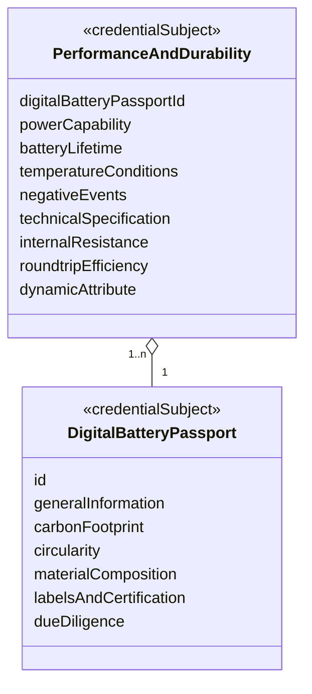
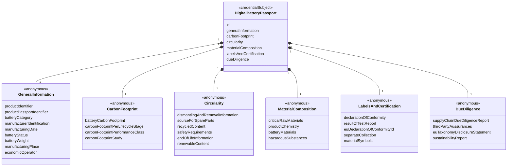
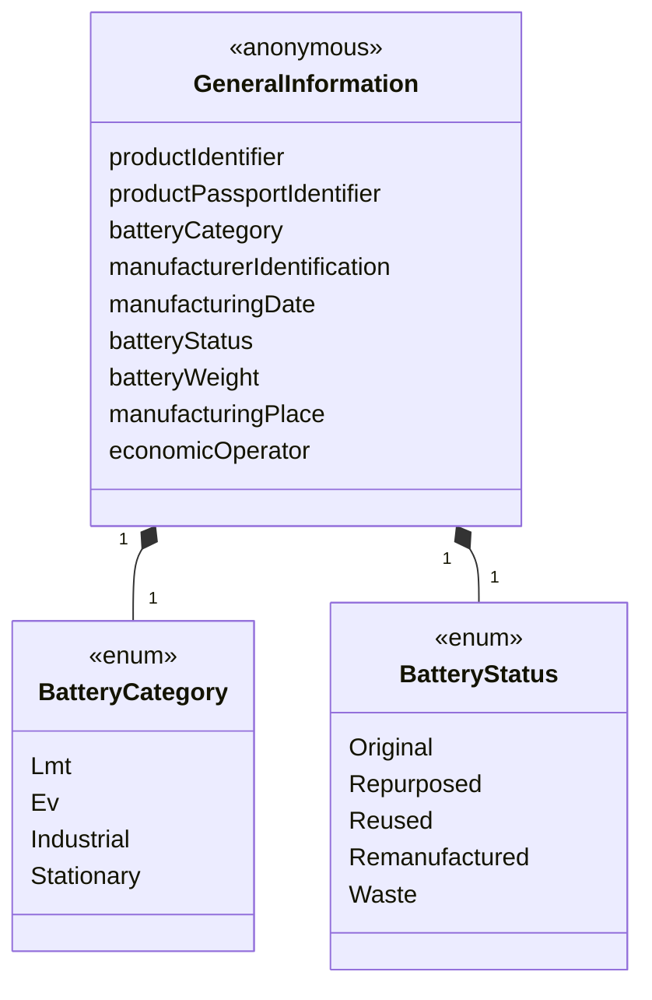
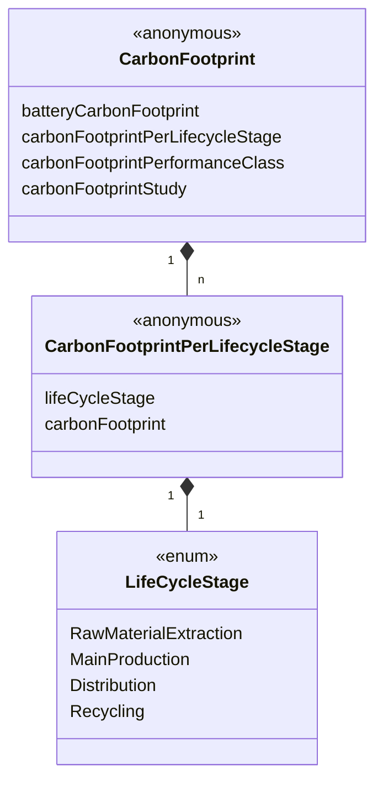
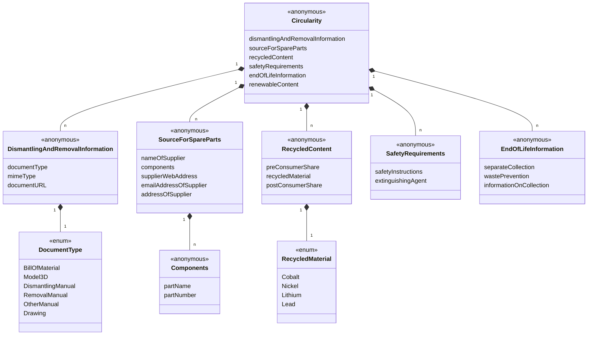
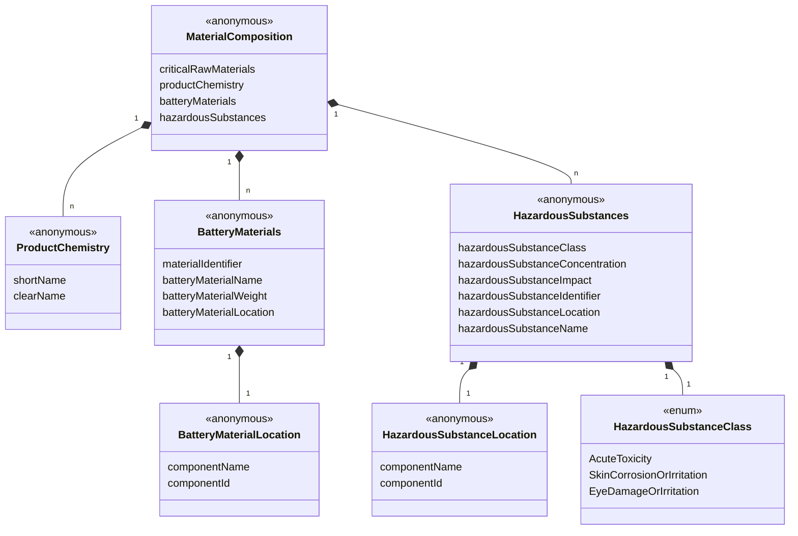
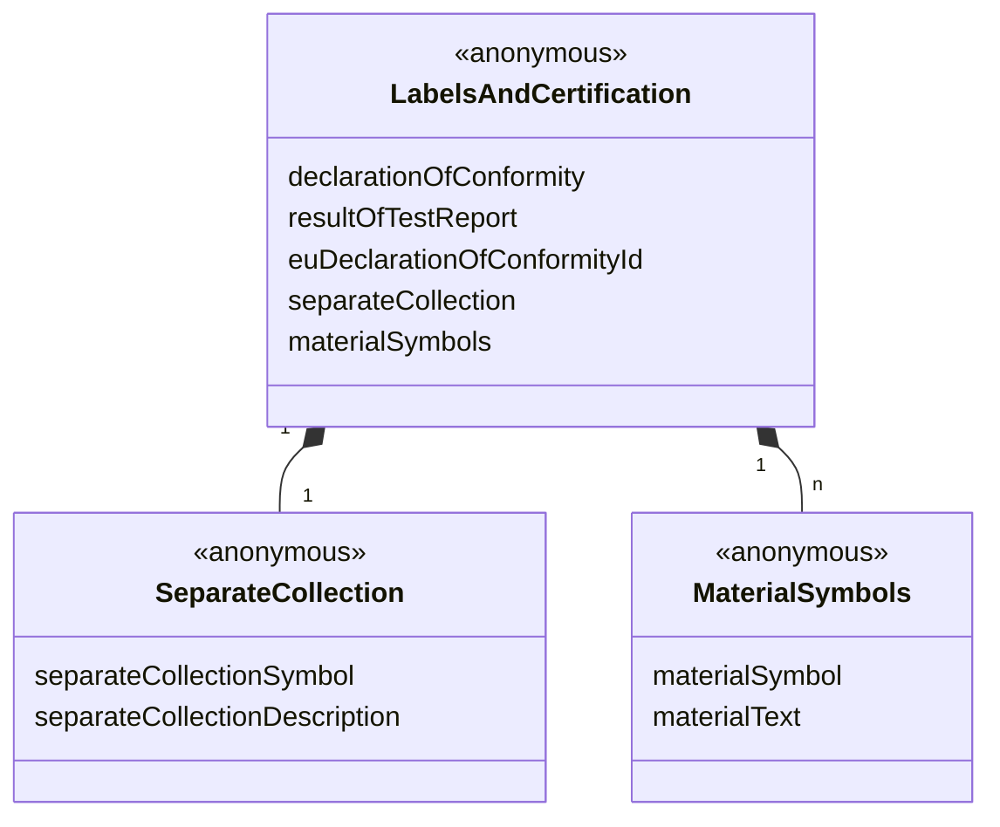
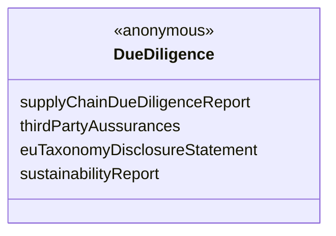
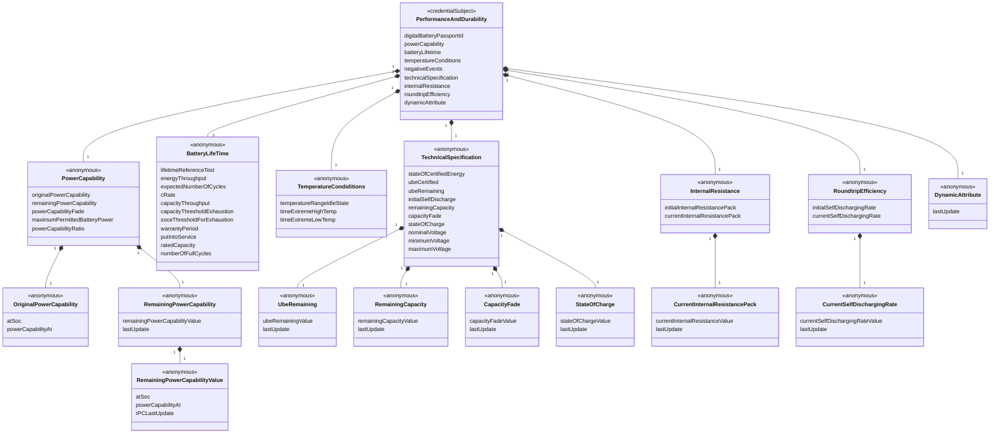

## 1 Abstract

This specification describes a vocabulary for asserting a digital battery pass (DBP). The semantic definitions for the battery pass are taken from [Battery Pass](https://thebatterypass.eu/). The vocabulary is intended to be used to define a battery pass as a credentialSubject of an W3C-Credentials [Verifiable Credentials Data Model v2.0](https://www.w3.org/TR/vc-data-model-2.0). It can be used together with enterprise credentials to get full verifiable battery passes. In this case properties linking to enterprises must be identifiers which allow authentication of the owner, e.g. DIDs.

Click here to open the JSON-LD file: [dbp.jsonld](https://dpp-vocabulary.spherity.com/contexts/dbp/v1.jsonld)

## 2 Use Case and Requirements

## 3 Examples

```json
{
  "@context": "https://dpp-vocabulary.spherity.com/contexts/dbp/v1.jsonld",
  "id": "did:web:impactnewenergy.com:dbp:640-265-c-00-640-2405-00024-826-b-01-c-2001-a-0-ea-8",
  "type": "DigitalBatteryPassport",
  "generalInformation": {
    "productIdentifier": "did:web:impactnewenergy.com:dbp:640-265-c-00-640-2405-00024-826-b-01-c-2001-a-0-ea-8",
    "batteryCategory": "Ev",
    "manufacturerIdentification": "did:web:impactnewenergy.com",
    "manufacturingDate": "2024-01-01T00:00:00Z",
    "batteryStatus": "Original",
    "batteryWeight": 550,
    "manufacturingPlace": {
      "addressCountry": "PL",
      "addressStreet": "Przejazdowa 22",
      "postalCode": "05-800",
      "addressLocality": "Pruszków"
    },
    "economicOperator": "did:web:solarisbus.com"
  },
  "carbonFootprint": {
    "batteryCarbonFootprint": 0.20315,
    "carbonFootprintPerLifecycleStage": [
      {
        "lifeCycleStage": "RawMaterialExtraction",
        "carbonFootprint": 7.18
      },
      {
        "lifeCycleStage": "MainProduction",
        "carbonFootprint": 0.22
      },
      {
        "lifeCycleStage": "Distribution",
        "carbonFootprint": 0.42
      },
      {
        "lifeCycleStage": "Recycling",
        "carbonFootprint": 92.19
      }
    ],
    "carbonFootprintStudy": "https://ghgprotocol.org/sites/default/files/standards/Product-Life-Cycle-Accounting-Reporting-Standard_041613.pdf"
  },
  "circularity": {
    "sourceForSpareParts": {
      "nameOfSupplier": "Impact Clean Power Technology S.A.",
      "emailAddressOfSupplier": "email:info@icpt.pl",
      "supplierWebAddress": "https://impactnewenergy.com",
      "addressOfSupplier": {
        "addressCountry": "PL",
        "addressStreet": "Przejazdowa 22",
        "postalCode": "05-800",
        "addressLocality": "Pruszków"
      }
    },
    "recycledContent": [
      {
        "preConsumerShare": 95,
        "recycledMaterial": "Cobalt",
        "postConsumerShare": 95
      },
      {
        "preConsumerShare": 95,
        "recycledMaterial": "Nickel",
        "postConsumerShare": 95
      },
      {
        "preConsumerShare": 95,
        "recycledMaterial": "Lithium",
        "postConsumerShare": 95
      }
    ],
    "safetyRequirements": {
      "safetyInstructions": "https://files-vera.spherity.com/solaris/Safety%20measures.pdf",
      "extinguishingAgent": "Class C"
    }
  },
  "materialComposition": {
    "criticalRawMaterials": [
      "Lithium",
      "Antimony",
      "Phosphorus",
      "Bauxite/Alumina/Aluminium",
      "Silicon metal",
      "Bismuth",
      "Cobalt",
      "Magnesium",
      "Titanium metal",
      "Manganese",
      "Copper",
      "Graphite",
      "Nickel"
    ],
    "batteryChemistry": {
      "shortName": "NMC/Gr",
      "longName": "Lithium-Nickel-Manganese-Cobalt-Oxide (LiNiMnCoO2)/Graphite"
    },
    "batteryMaterial": [
      {
        "batteryMaterialLocation": {
          "componentName": "Cathode"
        },
        "batteryMaterialWeight": 6.125,
        "batteryMaterialName": "Aluminum (metal)",
        "materialIdentifier": "7429-90-5"
      },
      {
        "batteryMaterialLocation": {
          "componentName": "Cathode"
        },
        "batteryMaterialWeight": 7.125,
        "batteryMaterialName": "Lithium",
        "materialIdentifier": "7439-93-2"
      },
      {
        "batteryMaterialLocation": {
          "componentName": "Cathode"
        },
        "batteryMaterialWeight": 44.875,
        "batteryMaterialName": "Nickel oxide",
        "materialIdentifier": "11099-02-8"
      },
      {
        "batteryMaterialLocation": {
          "componentName": "Cathode"
        },
        "batteryMaterialWeight": 19.375,
        "batteryMaterialName": "Cobalt oxide",
        "materialIdentifier": "1307-96-6"
      },
      {
        "batteryMaterialLocation": "Cathode",
        "batteryMaterialWeight": 19.375,
        "batteryMaterialName": "Manganese oxide",
        "materialIdentifier": "1344-43-0"
      },
      {
        "batteryMaterialLocation": {
          "componentName": "Cathode"
        },
        "batteryMaterialWeight": 3.125,
        "batteryMaterialName": "Confidential",
        "materialIdentifier": "System"
      },
      {
        "batteryMaterialLocation": {
          "componentName": "Anode"
        },
        "batteryMaterialWeight": 19.6,
        "batteryMaterialName": "Copper",
        "materialIdentifier": "7440-50-8"
      },
      {
        "batteryMaterialLocation": {
          "componentName": "Anode"
        },
        "batteryMaterialWeight": 77.6,
        "batteryMaterialName": "Carbon",
        "materialIdentifier": "7440-44-0"
      },
      {
        "batteryMaterialLocation": {
          "componentName": "Anode"
        },
        "batteryMaterialWeight": 2.8,
        "batteryMaterialName": "Confidential",
        "materialIdentifier": "System"
      },
      {
        "batteryMaterialLocation": {
          "componentName": "Electrolyte"
        },
        "batteryMaterialWeight": 12.5,
        "batteryMaterialName": "Lithium hexafluorophosphate",
        "materialIdentifier": "21324-40-3"
      },
      {
        "batteryMaterialLocation": {
          "componentName": "Electrolyte"
        },
        "batteryMaterialWeight": 51,
        "batteryMaterialName": "Ethyl Methyl Carbonate",
        "materialIdentifier": "623-53-0"
      },
      {
        "batteryMaterialLocation": {
          "componentName": "Electrolyte"
        },
        "batteryMaterialWeight": 28,
        "batteryMaterialName": "Ethylene carbonate",
        "materialIdentifier": "96-49-1"
      },
      {
        "batteryMaterialLocation": {
          "componentName": "Electrolyte"
        },
        "batteryMaterialWeight": 8.5,
        "batteryMaterialName": "Confidential",
        "materialIdentifier": "System"
      }
    ]
  },
  "labelsAndCertification": {
    "resultsOfTestReports": "https://files-vera.spherity.com/solaris/Test%20report.pdf",
    "separateCollectionSymbol": "https://europa.eu/youreurope/business/images/icons/WEEE_symbol.png",
    "euDeclarationOfConformity": "https://files-vera.spherity.com/solaris/EU%20declaration.pdf",
    "meaningOfLabelsAndSymbols": "https://files-vera.spherity.com/solaris/Label%20explanation.pdf"
  },
  "dueDiligence": {
    "supplyChainDueDiligenceReport": "https://www.solarisbus.com/public/assets/content/firma/esg/2023/Raport_Zrownowazonego_Rozwoju_2023_ENG.pdf",
    "sustainabilityReport": "https://www.solarisbus.com/public/assets/content/firma/esg/2023/Raport_Zrownowazonego_Rozwoju_2023_ENG.pdf"
  }
}

```
## 4 Information Model

The battery pass conists of a static `DigitalBatteryPassport` credential and a list of `PerformanceAndDurability` credentials which refer to the `DigitalBatteryPassport` credential. The `PerformanceAndDurability` credentials contain the dynamic lifetime data of the battery. The reference is defined in the property `digitalBatteryPassportId` of the referencing `PerformanceAndDurability` credential. 




### 4.1 DigitalBatteryPassport



#### 4.1.1 GeneralInformation



#### 4.1.2 CarbonFootprint



#### 4.1.3 Circularity



#### 4.1.4 MaterialComposition



#### 4.1.5 LabelsAndCertification



#### 4.1.6 DueDiligence



### 4.2 PerformanceAndDurability



## 5 Classes

### 5.1 DigitalBatteryPassportCertificate {#DigitalBatteryPassportCertificate}

### 5.2 DigitalBatteryPassport {#DigitalBatteryPassport}

### 5.3 PerformanceAndDurability {#PerformanceAndDurability}

## 6 Properties

### 6.1 Properties of DigitalBatteryPassport

#### 6.1.1 generalInformation {#DigitalBatteryPassport_generalInformation}

##### 6.1.1.1 productIdentifier {#DigitalBatteryPassport_generalInformation_productIdentifier}

The `productIdentifier` uniquely identifies the product within a digital battery passport. It helps ensure traceability and compliance with industry standards.

| **Key**          | **Value**                                                                            |
|------------------|--------------------------------------------------------------------------------------|
| **Term**         | productIdentifier                                                                    |
| **URL**          | https://dpp-vocabulary.spherity.com/dbp#DigitalBatteryPassport_generalInformation_productIdentifier |
| **Expected Value** | Alphanumeric String                                                                 |


##### 6.1.1.2 productPassportIdentifier {#DigitalBatteryPassport_generalInformation_productPassportIdentifier}

The `productPassportIdentifier` is a unique alphanumeric code used to unambiguously identify each individual battery and its associated digital passport. This identifier ensures consistency and traceability and follows the specified URN format.

| **Key**          | **Value**                                                                            |
|------------------|--------------------------------------------------------------------------------------|
| **Term**         | productPassportIdentifier                                                            |
| **URL**          | https://dpp-vocabulary.spherity.com/dbp#DigitalBatteryPassport_generalInformation_productPassportIdentifier |
| **Expected Value** | Alphanumeric String following the specified URN pattern                              |


##### 6.1.1.3 batteryCategory {#DigitalBatteryPassport_generalInformation_batteryCategory}

The `batteryCategory` defines the relevant category of the battery for the digital passport, such as "lmt" for Light Means of Transport or "ev" for Electric Vehicle.

| **Key**          | **Value**                                                                            |
|------------------|--------------------------------------------------------------------------------------|
| **Term**         | batteryCategory                                                                      |
| **URL**          | https://dpp-vocabulary.spherity.com/dbp#DigitalBatteryPassport_generalInformation_batteryCategory |
| **Expected Value** | One of: "lmt", "ev", "industrial", "stationary"                                     |


##### 6.1.1.4 manufacturerIdentification {#DigitalBatteryPassport_generalInformation_manufacturerIdentification}

The `manufacturerIdentification` includes the manufacturer’s name, address, and other identifying details necessary for compliance and product tracing.

| **Key**          | **Value**                                                                            |
|------------------|--------------------------------------------------------------------------------------|
| **Term**         | manufacturerIdentification                                                           |
| **URL**          | https://dpp-vocabulary.spherity.com/dbp#DigitalBatteryPassport_generalInformation_manufacturerIdentification |
| **Expected Value** | Text including name, trade name, address, and contact details                        |


##### 6.1.1.5 manufacturingDate {#DigitalBatteryPassport_generalInformation_manufacturingDate}

The `manufacturingDate` specifies the date when the battery was produced, recorded in the format YYYY-MM.

| **Key**          | **Value**                                                                            |
|------------------|--------------------------------------------------------------------------------------|
| **Term**         | manufacturingDate                                                                    |
| **URL**          | https://dpp-vocabulary.spherity.com/dbp#DigitalBatteryPassport_generalInformation_manufacturingDate |
| **Expected Value** | Date in the format YYYY-MM                                                           |


##### 6.1.1.6 batteryStatus {#DigitalBatteryPassport_generalInformation_batteryStatus}

The `batteryStatus` indicates the lifecycle phase of the battery, such as "Original" or "Reused," which is essential for managing battery recycling and reuse.

| **Key**          | **Value**                                                                            |
|------------------|--------------------------------------------------------------------------------------|
| **Term**         | batteryStatus                                                                        |
| **URL**          | https://dpp-vocabulary.spherity.com/dbp#DigitalBatteryPassport_generalInformation_batteryStatus |
| **Expected Value** | One of: "Original", "Repurposed", "Reused", "Remanufactured", "Waste"               |


##### 6.1.1.7 batteryWeight {#DigitalBatteryPassport_generalInformation_batteryWeight}

The `batteryWeight` indicates the total weight of the battery in kilograms, crucial for logistics and recycling purposes.

| **Key**          | **Value**                                                                            |
|------------------|--------------------------------------------------------------------------------------|
| **Term**         | batteryWeight                                                                        |
| **URL**          | https://dpp-vocabulary.spherity.com/dbp#DigitalBatteryPassport_generalInformation_batteryWeight |
| **Expected Value** | Numerical value in kilograms                                                         |


##### 6.1.1.8 manufacturingPlace {#DigitalBatteryPassport_generalInformation_manufacturingPlace}

The `manufacturingPlace` provides details about where the battery was manufactured, including the country, city, and street address.

| **Key**          | **Value**                                                                            |
|------------------|--------------------------------------------------------------------------------------|
| **Term**         | manufacturingPlace                                                                   |
| **URL**          | https://dpp-vocabulary.spherity.com/dbp#DigitalBatteryPassport_generalInformation_manufacturingPlace |
| **Expected Value** | Object with details such as country, postal code, and street address                 |


##### 6.1.1.9 economicOperator {#DigitalBatteryPassport_generalInformation_economicOperator}

The `economicOperator` identifies the entity responsible for placing the battery on the market or putting it into service, with necessary contact details.

| **Key**          | **Value**                                                                            |
|------------------|--------------------------------------------------------------------------------------|
| **Term**         | economicOperator                                                                     |
| **URL**          | https://dpp-vocabulary.spherity.com/dbp#DigitalBatteryPassport_generalInformation_economicOperator |
| **Expected Value** | Text including name, trade name, address, and contact details                        |

#### 6.1.2 carbonFootprint {#DigitalBatteryPassport_carbonFootprint}

##### 6.1.2.1 batteryCarbonFootprint {#DigitalBatteryPassport_carbonFootprint_batteryCarbonFootprint}

The `batteryCarbonFootprint` is the carbon footprint of the battery, calculated as kg of carbon dioxide equivalent per one kWh of the total energy provided by the battery over its expected service life, as declared in the Carbon Footprint Declaration.

| **Key**          | **Value**                                                                            |
|------------------|--------------------------------------------------------------------------------------|
| **Term**         | batteryCarbonFootprint                                                               |
| **URL**          | https://dpp-vocabulary.spherity.com/dbp#DigitalBatteryPassport_carbonFootprint_batteryCarbonFootprint |
| **Expected Value** | Numerical value representing kg of CO2 equivalent per kWh                            |


##### 6.1.2.2 carbonFootprintPerLifecycleStage {#DigitalBatteryPassport_carbonFootprint_carbonFootprintPerLifecycleStage}

The `carbonFootprintPerLifecycleStage` is the carbon footprint of the battery as a share of the total Battery Carbon Footprint, differentiated per lifecycle stages: raw material extraction, battery production, distribution, and recycling.

| **Key**          | **Value**                                                                            |
|------------------|--------------------------------------------------------------------------------------|
| **Term**         | carbonFootprintPerLifecycleStage                                                     |
| **URL**          | https://dpp-vocabulary.spherity.com/dbp#DigitalBatteryPassport_carbonFootprint_carbonFootprintPerLifecycleStage |
| **Expected Value** | Array of objects, each specifying lifecycle stage and carbon footprint               |


#### 6.1.2.2.1 lifecycleStage {#DigitalBatteryPassport_carbonFootprint_carbonFootprintPerLifecycleStage_lifecycleStage}

The `lifecycleStage` describes the specific phase in the battery’s lifecycle, such as RawMaterialExtraction or Recycling.

| **Key**          | **Value**                                                                            |
|------------------|--------------------------------------------------------------------------------------|
| **Term**         | lifecycleStage                                                                       |
| **URL**          | https://dpp-vocabulary.spherity.com/dbp#DigitalBatteryPassport_carbonFootprint_carbonFootprintPerLifecycleStage_lifecycleStage |
| **Expected Value** | One of: "RawMaterialExtraction", "MainProduction", "Distribution", "Recycling"       |


#### 6.1.2.2.2 carbonFootprint {#DigitalBatteryPassport_carbonFootprint_carbonFootprintPerLifecycleStage_carbonFootprint}

The `carbonFootprint` represents the carbon emissions for the specified lifecycle stage, measured as kg of CO2 equivalent.

| **Key**          | **Value**                                                                            |
|------------------|--------------------------------------------------------------------------------------|
| **Term**         | carbonFootprint                                                                      |
| **URL**          | https://dpp-vocabulary.spherity.com/dbp#DigitalBatteryPassport_carbonFootprint_carbonFootprintPerLifecycleStage_carbonFootprint |
| **Expected Value** | Numerical value representing kg of CO2 equivalent                                    |


##### 6.1.2.3 carbonFootprintPerformanceClass {#DigitalBatteryPassport_carbonFootprint_carbonFootprintPerformanceClass}

The `carbonFootprintPerformanceClass` indicates the performance class of the battery in terms of its carbon footprint, with category A being the best class with the lowest lifecycle impact.

| **Key**          | **Value**                                                                            |
|------------------|--------------------------------------------------------------------------------------|
| **Term**         | carbonFootprintPerformanceClass                                                      |
| **URL**          | https://dpp-vocabulary.spherity.com/dbp#DigitalBatteryPassport_carbonFootprint_carbonFootprintPerformanceClass |
| **Expected Value** | Text indicating performance class, e.g., "A", "B", etc.                              |


##### 6.1.2.4 carbonFootprintStudy {#DigitalBatteryPassport_carbonFootprint_carbonFootprintStudy}

The `carbonFootprintStudy` provides a web link to access a public version of the study that supports the carbon footprint values.

| **Key**          | **Value**                                                                            |
|------------------|--------------------------------------------------------------------------------------|
| **Term**         | carbonFootprintStudy                                                                 |
| **URL**          | https://dpp-vocabulary.spherity.com/dbp#DigitalBatteryPassport_carbonFootprint_carbonFootprintStudy |
| **Expected Value** | URI linking to the carbon footprint study                                            |

#### 6.1.3 circularity {#DigitalBatteryPassport_circularity}

##### 6.1.3.1 dismantlingAndRemovalInformation {#DigitalBatteryPassport_circularity_dismantlingAndRemovalInformation}

Dismantling and Removal information, including at least:
- Exploded diagrams of the battery system/pack showing the location of battery cells
- Disassembly sequences
- Type and number of fastening techniques to be unlocked
- Tools required for disassembly
- Warnings if risk of damaging parts exists
- Amount of cells used and layout

| **Key**          | **Value**                                                                            |
|------------------|--------------------------------------------------------------------------------------|
| **Term**         | dismantlingAndRemovalInformation                                                     |
| **URL**          | https://dpp-vocabulary.spherity.com/dbp#DigitalBatteryPassport_circularity_dismantlingAndRemovalInformation |
| **Expected Value** | Set of documentation objects, each containing details like documentType, mimeType, and documentURL |


###### 6.1.3.1.1 documentType {#DigitalBatteryPassport_circularity_dismantlingAndRemovalInformation_documentType}

The `documentType` specifies the type of documentation provided, such as exploded diagrams or disassembly instructions.

| **Key**          | **Value**                                                                            |
|------------------|--------------------------------------------------------------------------------------|
| **Term**         | documentType                                                                         |
| **URL**          | https://dpp-vocabulary.spherity.com/dbp#DigitalBatteryPassport_circularity_dismantlingAndRemovalInformation_documentType |
| **Expected Value** | One of: "BillOfMaterial", "Model3D", "DismantlingManual", "RemovalManual", "OtherManual", "Drawing" |


###### 6.1.3.1.2 mimeType {#DigitalBatteryPassport_circularity_dismantlingAndRemovalInformation_mimeType}

The `mimeType` defines the format of the documentation, such as PDF, PNG, or other media types.

| **Key**          | **Value**                                                                            |
|------------------|--------------------------------------------------------------------------------------|
| **Term**         | mimeType                                                                             |
| **URL**          | https://dpp-vocabulary.spherity.com/dbp#DigitalBatteryPassport_circularity_dismantlingAndRemovalInformation_mimeType |
| **Expected Value** | String indicating the MIME type, e.g., "application/pdf", "image/png"               |


###### 6.1.3.1.3 documentURL {#DigitalBatteryPassport_circularity_dismantlingAndRemovalInformation_documentURL}

The `documentURL` is a link to the documentation, providing access to the dismantling and removal information.

| **Key**          | **Value**                                                                            |
|------------------|--------------------------------------------------------------------------------------|
| **Term**         | documentURL                                                                          |
| **URL**          | https://dpp-vocabulary.spherity.com/dbp#DigitalBatteryPassport_circularity_dismantlingAndRemovalInformation_documentURL |
| **Expected Value** | URL linking to the document                                                        |


##### 6.1.3.2 sourceForSpareParts {#DigitalBatteryPassport_circularity_sourceForSpareParts}

Contact details of sources for replacement spares, including postal address, name and brand names, postal code and place, street and number, country, and telephone (if any).

| **Key**          | **Value**                                                                            |
|------------------|--------------------------------------------------------------------------------------|
| **Term**         | sourceForSpareParts                                                                  |
| **URL**          | https://dpp-vocabulary.spherity.com/dbp#DigitalBatteryPassport_circularity_sourceForSpareParts |
| **Expected Value** | Set of spare part supplier objects, each containing supplier name, address, email, and component list |


###### 6.1.3.2.1 nameOfSupplier {#DigitalBatteryPassport_circularity_sourceForSpareParts_nameOfSupplier}

The `nameOfSupplier` specifies the name or trade name of the supplier providing spare parts.

| **Key**          | **Value**                                                                            |
|------------------|--------------------------------------------------------------------------------------|
| **Term**         | nameOfSupplier                                                                       |
| **URL**          | https://dpp-vocabulary.spherity.com/dbp#DigitalBatteryPassport_circularity_sourceForSpareParts_nameOfSupplier |
| **Expected Value** | Text containing the supplier's name or brand name                                  |


###### 6.1.3.2.2 components {#DigitalBatteryPassport_circularity_sourceForSpareParts_components}

The `components` section lists spare parts available from the supplier, including part names and numbers.

| **Key**          | **Value**                                                                            |
|------------------|--------------------------------------------------------------------------------------|
| **Term**         | components                                                                           |
| **URL**          | https://dpp-vocabulary.spherity.com/dbp#DigitalBatteryPassport_circularity_sourceForSpareParts_components |
| **Expected Value** | Set of objects, each containing part name and part number                          |


###### 6.1.3.2.2.1 partName {#DigitalBatteryPassport_circularity_sourceForSpareParts_components_partName}

The `partName` specifies the name of an individual component within the battery system. This information is crucial for identification and reference, enabling effective communication regarding the specific parts needed for maintenance, repair, or replacement.

| **Key**          | **Value**                                                                            |
|------------------|--------------------------------------------------------------------------------------|
| **Term**         | partName                                                                             |
| **URL**          | https://dpp-vocabulary.spherity.com/dbp#DigitalBatteryPassport_circularity_sourceForSpareParts_components_partName |
| **Expected Value** | Human-readable text indicating the name of the component (e.g., "Battery Cell", "Connector") |


###### 6.1.3.2.2.2 partNumber {#DigitalBatteryPassport_circularity_sourceForSpareParts_components_partNumber}

The `partNumber` is a unique identifier assigned to each component of the battery system. This identifier is essential for accurate tracking, ordering, and managing inventory of spare parts, ensuring that the correct parts are procured for maintenance or replacement.

| **Key**          | **Value**                                                                            |
|------------------|--------------------------------------------------------------------------------------|
| **Term**         | partNumber                                                                           |
| **URL**          | https://dpp-vocabulary.spherity.com/dbp#DigitalBatteryPassport_circularity_sourceForSpareParts_components_partNumber |
| **Expected Value** | Alphanumeric string that uniquely identifies the component part number               |


###### 6.1.3.2.3 supplierWebAddress {#DigitalBatteryPassport_circularity_sourceForSpareParts_supplierWebAddress}

The `supplierWebAddress` provides the URL to the website of the supplier for the battery components. This information is vital for verifying supplier credibility, obtaining additional information about the products offered, and facilitating the procurement process for spare parts.

| **Key**          | **Value**                                                                            |
|------------------|--------------------------------------------------------------------------------------|
| **Term**         | supplierWebAddress                                                                   |
| **URL**          | https://dpp-vocabulary.spherity.com/dbp#DigitalBatteryPassport_circularity_sourceForSpareParts_supplierWebAddress |
| **Expected Value** | URL linking to the supplier's website                                              |


###### 6.1.3.2.4 emailAddressOfSupplier {#DigitalBatteryPassport_circularity_sourceForSpareParts_emailAddressOfSupplier}

The `emailAddressOfSupplier` specifies the contact email address for the supplier of the battery components. This information is important for facilitating direct communication regarding orders, inquiries, and support related to the components.

| **Key**          | **Value**                                                                            |
|------------------|--------------------------------------------------------------------------------------|
| **Term**         | emailAddressOfSupplier                                                               |
| **URL**          | https://dpp-vocabulary.spherity.com/dbp#DigitalBatteryPassport_circularity_sourceForSpareParts_emailAddressOfSupplier |
| **Expected Value** | Valid email address for contacting the supplier                                     |


###### 6.1.3.2.5 addressOfSupplier {#DigitalBatteryPassport_circularity_sourceForSpareParts_addressOfSupplier}

The `addressOfSupplier` provides the physical address of the supplier for the battery components. This information is essential for logistics, including shipping and handling of orders, and for verifying the supplier's location and legitimacy.

| **Key**          | **Value**                                                                            |
|------------------|--------------------------------------------------------------------------------------|
| **Term**         | addressOfSupplier                                                                     |
| **URL**          | https://dpp-vocabulary.spherity.com/dbp#DigitalBatteryPassport_circularity_sourceForSpareParts_addressOfSupplier |
| **Expected Value** | Structured address information including street, city, postal code, and country    |


##### 6.1.3.3 recycledContent {#DigitalBatteryPassport_circularity_recycledContent}

Share of material recovered from waste present in active materials for each battery model per year and per manufacturing plant.

| **Key**          | **Value**                                                                            |
|------------------|--------------------------------------------------------------------------------------|
| **Term**         | recycledContent                                                                      |
| **URL**          | https://dpp-vocabulary.spherity.com/dbp#DigitalBatteryPassport_circularity_recycledContent |
| **Expected Value** | Set of objects indicating preConsumerShare, recycledMaterial, and postConsumerShare |


###### 6.1.3.3.1 preConsumerShare {#DigitalBatteryPassport_circularity_recycledContent_preConsumerShare}

The `preConsumerShare` is the percentage of recycled content derived from pre-consumer waste.

| **Key**          | **Value**                                                                            |
|------------------|--------------------------------------------------------------------------------------|
| **Term**         | preConsumerShare                                                                     |
| **URL**          | https://dpp-vocabulary.spherity.com/dbp#DigitalBatteryPassport_circularity_recycledContent_preConsumerShare |
| **Expected Value** | Numerical value representing the percentage of pre-consumer recycled content       |


###### 6.1.3.3.2 recycledMaterial {#DigitalBatteryPassport_circularity_recycledContent_recycledMaterial}

The `recycledMaterial` details the types of recycled materials used, such as Cobalt, Nickel, Lithium, or Lead.

| **Key**          | **Value**                                                                            |
|------------------|--------------------------------------------------------------------------------------|
| **Term**         | recycledMaterial                                                                     |
| **URL**          | https://dpp-vocabulary.spherity.com/dbp#DigitalBatteryPassport_circularity_recycledContent_recycledMaterial |
| **Expected Value** | Set of material types, e.g., "Cobalt", "Nickel", "Lithium", "Lead"                 |


###### 6.1.3.3.3 postConsumerShare {#DigitalBatteryPassport_circularity_recycledContent_postConsumerShare}

The `postConsumerShare` is the percentage of recycled content obtained from post-consumer waste.

| **Key**          | **Value**                                                                            |
|------------------|--------------------------------------------------------------------------------------|
| **Term**         | postConsumerShare                                                                    |
| **URL**          | https://dpp-vocabulary.spherity.com/dbp#DigitalBatteryPassport_circularity_recycledContent_postConsumerShare |
| **Expected Value** | Numerical value representing the percentage of post-consumer recycled content      |


##### 6.1.3.4 safetyRequirements {#DigitalBatteryPassport_circularity_safetyRequirements}

Safety measures and instructions, which should consider past negative and extreme events, as well as the separate data attributes “battery status” and “battery composition/chemistry.”

| **Key**          | **Value**                                                                            |
|------------------|--------------------------------------------------------------------------------------|
| **Term**         | safetyRequirements                                                                   |
| **URL**          | https://dpp-vocabulary.spherity.com/dbp#DigitalBatteryPassport_circularity_safetyRequirements |
| **Expected Value** | Object containing safety instructions and a list of usable extinguishing agents      |


###### 6.1.3.4.1 safetyInstructions {#DigitalBatteryPassport_circularity_safetyRequirements_safetyInstructions}

The `safetyInstructions` detail specific precautions and actions to be taken for battery safety.

| **Key**          | **Value**                                                                            |
|------------------|--------------------------------------------------------------------------------------|
| **Term**         | safetyInstructions                                                                   |
| **URL**          | https://dpp-vocabulary.spherity.com/dbp#DigitalBatteryPassport_circularity_safetyRequirements_safetyInstructions |
| **Expected Value** | Text providing detailed safety instructions                                        |


###### 6.1.3.4.2 extinguishingAgent {#DigitalBatteryPassport_circularity_safetyRequirements_extinguishingAgent}

The `extinguishingAgent` specifies which agents can be used to safely extinguish fires involving the battery.

| **Key**          | **Value**                                                                            |
|------------------|--------------------------------------------------------------------------------------|
| **Term**         | extinguishingAgent                                                                   |
| **URL**          | https://dpp-vocabulary.spherity.com/dbp#DigitalBatteryPassport_circularity_safetyRequirements_extinguishingAgent |
| **Expected Value** | List of suitable extinguishing agents, e.g., "foam", "CO2", "dry chemical"         |


##### 6.1.3.5 endOfLifeInformation {#DigitalBatteryPassport_circularity_endOfLifeInformation}

Producer or producer responsibility organisations shall make information available to distributors and end-users on:
- The role of end-users in contributing to waste prevention
- Good practices and recommendations concerning the use of batteries to extend their use phase
- Possibilities of re-use, preparing for re-use, repurpose, repurposing, and remanufacturing

| **Key**          | **Value**                                                                            |
|------------------|--------------------------------------------------------------------------------------|
| **Term**         | endOfLifeInformation                                                                 |
| **URL**          | https://dpp-vocabulary.spherity.com/dbp#DigitalBatteryPassport_circularity_endOfLifeInformation |
| **Expected Value** | Object containing waste prevention, separate collection, and information on collection |

###### 6.1.3.5.1 separateCollection {#DigitalBatteryPassport_circularity_endOfLifeInformation_separateCollection}

The `separateCollection` attribute specifies whether the battery must be collected separately at the end of its life.

| **Key**          | **Value**                                                                            |
|------------------|--------------------------------------------------------------------------------------|
| **Term**         | separateCollection                                                                   |
| **URL**          | https://dpp-vocabulary.spherity.com/dbp#DigitalBatteryPassport_circularity_endOfLifeInformation_separateCollection |
| **Expected Value** | Boolean value indicating if separate collection is required                        |

###### 6.1.3.5.2 wastePrevention {#DigitalBatteryPassport_circularity_endOfLifeInformation_wastePrevention}

The `wastePrevention` attribute provides recommendations for reducing battery waste.

| **Key**          | **Value**                                                                            |
|------------------|--------------------------------------------------------------------------------------|
| **Term**         | wastePrevention                                                                      |
| **URL**          | https://dpp-vocabulary.spherity.com/dbp#DigitalBatteryPassport_circularity_endOfLifeInformation_wastePrevention |
| **Expected Value** | Text with guidelines on waste prevention                                           |


###### 6.1.3.5.3 informationOnCollection {#DigitalBatteryPassport_circularity_endOfLifeInformation_informationOnCollection}

The `informationOnCollection` attribute includes details on how to properly collect and dispose of batteries.

| **Key**          | **Value**                                                                            |
|------------------|--------------------------------------------------------------------------------------|
| **Term**         | informationOnCollection                                                              |
| **URL**          | https://dpp-vocabulary.spherity.com/dbp#DigitalBatteryPassport_circularity_endOfLifeInformation_informationOnCollection |
| **Expected Value** | Text with instructions for proper collection and disposal                          |


##### 6.1.3.6 renewableContent {#DigitalBatteryPassport_circularity_renewableContent}

Share of renewable material content. A renewable material is a material made of natural resources that can be replenished.

| **Key**          | **Value**                                                                            |
|------------------|--------------------------------------------------------------------------------------|
| **Term**         | renewableContent                                                                     |
| **URL**          | https://dpp-vocabulary.spherity.com/dbp#DigitalBatteryPassport_circularity_renewableContent |
| **Expected Value** | Numerical value representing the percentage of renewable content                    |

#### 6.1.4 materialComposition {#DigitalBatteryPassport_materialComposition}

##### 6.1.4.1 criticalRawMaterials {#DigitalBatteryPassport_materialComposition_criticalRawMaterials}

Raw materials being economically important and vulnerable to supply disruption. The list of the Commission is subject to updating, reflecting production, market, and technological developments. In the battery passport, all critical raw materials above a concentration of 0.1% weight by weight within each component of the battery should be specified in an aggregated way.

| **Key**          | **Value**                                                                            |
|------------------|--------------------------------------------------------------------------------------|
| **Term**         | criticalRawMaterials                                                                 |
| **URL**          | https://dpp-vocabulary.spherity.com/dbp#DigitalBatteryPassport_materialComposition_criticalRawMaterials |
| **Expected Value** | Array of critical raw material names, as specified by the EU Raw Materials Information System |


##### 6.1.4.2 productChemistry {#DigitalBatteryPassport_materialComposition_productChemistry}

Composition of a product in general terms by specifying the cathode and anode active material, as well as the electrolyte.

| **Key**          | **Value**                                                                            |
|------------------|--------------------------------------------------------------------------------------|
| **Term**         | productChemistry                                                                     |
| **URL**          | https://dpp-vocabulary.spherity.com/dbp#DigitalBatteryPassport_materialComposition_productChemistry |
| **Expected Value** | Object containing details of cathode, anode, and electrolyte materials             |


###### 6.1.4.2.1 shortName {#DigitalBatteryPassport_materialComposition_productChemistry_shortName}

The `shortName` provides a simplified name for the chemistry of the battery.

| **Key**          | **Value**                                                                            |
|------------------|--------------------------------------------------------------------------------------|
| **Term**         | shortName                                                                            |
| **URL**          | https://dpp-vocabulary.spherity.com/dbp#DigitalBatteryPassport_materialComposition_productChemistry_shortName |
| **Expected Value** | Human-readable text                                                                 |


###### 6.1.4.2.2 clearName {#DigitalBatteryPassport_materialComposition_productChemistry_clearName}

The `clearName` is the full, unambiguous name of the battery chemistry.

| **Key**          | **Value**                                                                            |
|------------------|--------------------------------------------------------------------------------------|
| **Term**         | clearName                                                                            |
| **URL**          | https://dpp-vocabulary.spherity.com/dbp#DigitalBatteryPassport_materialComposition_productChemistry_clearName |
| **Expected Value** | Human-readable text                                                                 |


##### 6.1.4.3 batteryMaterials {#DigitalBatteryPassport_materialComposition_batteryMaterials}

"Component materials used": Naming the materials in the cathode, anode, and electrolyte according to public standards, including specification of the corresponding component. Reporting threshold: 0.1% weight by weight.

| **Key**          | **Value**                                                                            |
|------------------|--------------------------------------------------------------------------------------|
| **Term**         | batteryMaterials                                                                     |
| **URL**          | https://dpp-vocabulary.spherity.com/dbp#DigitalBatteryPassport_materialComposition_batteryMaterials |
| **Expected Value** | Array of material objects, each specifying the material name, identifier, and weight |


###### 6.1.4.3.1 materialIdentifier {#DigitalBatteryPassport_materialComposition_batteryMaterials_materialIdentifier}

The `materialIdentifier` is the CAS number of the material.

| **Key**          | **Value**                                                                            |
|------------------|--------------------------------------------------------------------------------------|
| **Term**         | materialIdentifier                                                                   |
| **URL**          | https://dpp-vocabulary.spherity.com/dbp#DigitalBatteryPassport_materialComposition_batteryMaterials_materialIdentifier |
| **Expected Value** | String formatted as a CAS number                                                   |


###### 6.1.4.3.2 batteryMaterialName {#DigitalBatteryPassport_materialComposition_batteryMaterials_batteryMaterialName}

The `batteryMaterialName` provides a clear and unambiguous name of the material.

| **Key**          | **Value**                                                                            |
|------------------|--------------------------------------------------------------------------------------|
| **Term**         | batteryMaterialName                                                                  |
| **URL**          | https://dpp-vocabulary.spherity.com/dbp#DigitalBatteryPassport_materialComposition_batteryMaterials_batteryMaterialName |
| **Expected Value** | Human-readable text                                                                 |


###### 6.1.4.3.3 batteryMaterialWeight {#DigitalBatteryPassport_materialComposition_batteryMaterials_batteryMaterialWeight}

The `batteryMaterialWeight` is the weight of the material component, measured in kilograms.

| **Key**          | **Value**                                                                            |
|------------------|--------------------------------------------------------------------------------------|
| **Term**         | batteryMaterialWeight                                                                |
| **URL**          | https://dpp-vocabulary.spherity.com/dbp#DigitalBatteryPassport_materialComposition_batteryMaterials_batteryMaterialWeight |
| **Expected Value** | Numerical value in kilograms                                                       |


###### 6.1.4.3.4 batteryMaterialLocation {#DigitalBatteryPassport_materialComposition_batteryMaterials_batteryMaterialLocation}

The `batteryMaterialLocation` specifies the battery component (e.g., cathode, anode, electrolyte) related to the material.

| **Key**          | **Value**                                                                            |
|------------------|--------------------------------------------------------------------------------------|
| **Term**         | batteryMaterialLocation                                                              |
| **URL**          | https://dpp-vocabulary.spherity.com/dbp#DigitalBatteryPassport_materialComposition_batteryMaterials_batteryMaterialLocation |
| **Expected Value** | Object specifying the component name and identifier                                |


###### 6.1.4.3.4.1 componentName {#DigitalBatteryPassport_materialComposition_batteryMaterials_batteryMaterialLocation_componentName}

The `componentName` specifies the name of the battery component in which the material is located. This designation is critical for understanding the role of each material in the battery's structure and function, facilitating better management of material sourcing and environmental impact.

| **Key**          | **Value**                                                                            |
|------------------|--------------------------------------------------------------------------------------|
| **Term**         | componentName                                                                        |
| **URL**          | https://dpp-vocabulary.spherity.com/dbp#DigitalBatteryPassport_materialComposition_batteryMaterials_batteryMaterialLocation_componentName |
| **Expected Value** | Human-readable text indicating the name of the component (e.g., "Cathode", "Anode") |


###### 6.1.4.3.4.2 componentId {#DigitalBatteryPassport_materialComposition_batteryMaterials_batteryMaterialLocation_componentId}

The `componentId` is a unique identifier assigned to each battery component. This identifier is essential for tracking and managing materials throughout the supply chain, ensuring compliance with regulations and facilitating inventory management.

| **Key**          | **Value**                                                                            |
|------------------|--------------------------------------------------------------------------------------|
| **Term**         | componentId                                                                          |
| **URL**          | https://dpp-vocabulary.spherity.com/dbp#DigitalBatteryPassport_materialComposition_batteryMaterials_batteryMaterialLocation_componentId |
| **Expected Value** | Alphanumeric string that uniquely identifies the battery component                   |


##### 6.1.4.4 hazardousSubstances {#DigitalBatteryPassport_materialComposition_hazardousSubstances}

"Hazardous substances": Name all hazardous substances that pose a threat to human health and the environment, reported above 0.1% weight by weight.

| **Key**          | **Value**                                                                            |
|------------------|--------------------------------------------------------------------------------------|
| **Term**         | hazardousSubstances                                                                  |
| **URL**          | https://dpp-vocabulary.spherity.com/dbp#DigitalBatteryPassport_materialComposition_hazardousSubstances |
| **Expected Value** | Array of hazardous substance objects, each specifying name, class, and concentration |


###### 6.1.4.4.1 hazardousSubstanceClass {#DigitalBatteryPassport_materialComposition_hazardousSubstances_hazardousSubstanceClass}

The `hazardousSubstanceClass` categorizes the substance based on its hazard class, such as acute toxicity or skin corrosion.

| **Key**          | **Value**                                                                            |
|------------------|--------------------------------------------------------------------------------------|
| **Term**         | hazardousSubstanceClass                                                              |
| **URL**          | https://dpp-vocabulary.spherity.com/dbp#DigitalBatteryPassport_materialComposition_hazardousSubstances_hazardousSubstanceClass |
| **Expected Value** | One of: "AcuteToxicity", "SkinCorrosionOrIrritation", "EyeDamageOrIrritation"      |


###### 6.1.4.4.2 hazardousSubstanceName {#DigitalBatteryPassport_materialComposition_hazardousSubstances_hazardousSubstanceName}

The `hazardousSubstanceName` provides the clear and unambiguous name of the hazardous substance.

| **Key**          | **Value**                                                                            |
|------------------|--------------------------------------------------------------------------------------|
| **Term**         | hazardousSubstanceName                                                               |
| **URL**          | https://dpp-vocabulary.spherity.com/dbp#DigitalBatteryPassport_materialComposition_hazardousSubstances_hazardousSubstanceName |
| **Expected Value** | Human-readable text                                                                 |


###### 6.1.4.4.3 hazardousSubstanceConcentration {#DigitalBatteryPassport_materialComposition_hazardousSubstances_hazardousSubstanceConcentration}

The `hazardousSubstanceConcentration` specifies the concentration of the hazardous substance, measured as a percentage.

| **Key**          | **Value**                                                                            |
|------------------|--------------------------------------------------------------------------------------|
| **Term**         | hazardousSubstanceConcentration                                                      |
| **URL**          | https://dpp-vocabulary.spherity.com/dbp#DigitalBatteryPassport_materialComposition_hazardousSubstances_hazardousSubstanceConcentration |
| **Expected Value** | Numerical value representing percentage                                            |


###### 6.1.4.4.4 hazardousSubstanceImpact {#DigitalBatteryPassport_materialComposition_hazardousSubstances_hazardousSubstanceImpact}

The `hazardousSubstanceImpact` lists the impacts of the hazardous substance based on regulations like REACH or GHS.

| **Key**          | **Value**                                                                            |
|------------------|--------------------------------------------------------------------------------------|
| **Term**         | hazardousSubstanceImpact                                                             |
| **URL**          | https://dpp-vocabulary.spherity.com/dbp#DigitalBatteryPassport_materialComposition_hazardousSubstances_hazardousSubstanceImpact |
| **Expected Value** | Array of impact statements                                                         |


###### 6.1.4.4.5 hazardousSubstanceLocation {#DigitalBatteryPassport_materialComposition_hazardousSubstances_hazardousSubstanceLocation}

The `hazardousSubstanceLocation` identifies where the hazardous substance is located within the battery component.

| **Key**          | **Value**                                                                            |
|------------------|--------------------------------------------------------------------------------------|
| **Term**         | hazardousSubstanceLocation                                                           |
| **URL**          | https://dpp-vocabulary.spherity.com/dbp#DigitalBatteryPassport_materialComposition_hazardousSubstances_hazardousSubstanceLocation |
| **Expected Value** | Object with details of the substance location                                      |


###### 6.1.4.4.6 hazardousSubstanceIdentifier {#DigitalBatteryPassport_materialComposition_hazardousSubstances_hazardousSubstanceIdentifier}

The `hazardousSubstanceIdentifier` is the CAS identifier of the hazardous substance.

| **Key**          | **Value**                                                                            |
|------------------|--------------------------------------------------------------------------------------|
| **Term**         | hazardousSubstanceIdentifier                                                         |
| **URL**          | https://dpp-vocabulary.spherity.com/dbp#DigitalBatteryPassport_materialComposition_hazardousSubstances_hazardousSubstanceIdentifier |
| **Expected Value** | String formatted as a CAS number                                                   |


#### 6.1.5 labelsAndCertification {#DigitalBatteryPassport_labelsAndCertification}

##### 6.1.5.1 declarationOfConformity {#DigitalBatteryPassport_labelsAndCertification_declarationOfConformity}

URL to the EU declaration of conformity signed by responsible economic operators to declare compliance with the regulatory requirements in the context of the market conformity assessment procedure and assume full responsibility.

| **Key**          | **Value**                                                                            |
|------------------|--------------------------------------------------------------------------------------|
| **Term**         | declarationOfConformity                                                              |
| **URL**          | https://dpp-vocabulary.spherity.com/dbp#DigitalBatteryPassport_labelsAndCertification_declarationOfConformity |
| **Expected Value** | URL linking to the declaration of conformity                                        |


##### 6.1.5.2 resultOfTestReport {#DigitalBatteryPassport_labelsAndCertification_resultOfTestReport}

URL to a document that includes results of test reports proving compliance in the market conformity assessment procedure with the requirements as per the technical documentation (Art. 7-10, Art. 12-14, and due diligence policies).

| **Key**          | **Value**                                                                            |
|------------------|--------------------------------------------------------------------------------------|
| **Term**         | resultOfTestReport                                                                   |
| **URL**          | https://dpp-vocabulary.spherity.com/dbp#DigitalBatteryPassport_labelsAndCertification_resultOfTestReport |
| **Expected Value** | URL linking to the test report document                                             |


##### 6.1.5.3 euDeclarationOfConformityId {#DigitalBatteryPassport_labelsAndCertification_euDeclarationOfConformityId}

Identification number of the EU declaration of conformity of the battery, linked to the Battery Carbon Footprint Declaration.

| **Key**          | **Value**                                                                            |
|------------------|--------------------------------------------------------------------------------------|
| **Term**         | euDeclarationOfConformityId                                                          |
| **URL**          | https://dpp-vocabulary.spherity.com/dbp#DigitalBatteryPassport_labelsAndCertification_euDeclarationOfConformityId |
| **Expected Value** | Alphanumeric identifier for the EU declaration                                      |


##### 6.1.5.4 separateCollection {#DigitalBatteryPassport_labelsAndCertification_separateCollection}

'Separate collection' or 'WEEE label' indicating that a product should not be discarded as unsorted waste but must be sent to separate collection facilities for recovery and recycling. To be printed on the physical label and displayed via the battery passport, suggested to be translated also to text to ensure machine readability.

| **Key**          | **Value**                                                                            |
|------------------|--------------------------------------------------------------------------------------|
| **Term**         | separateCollection                                                                   |
| **URL**          | https://dpp-vocabulary.spherity.com/dbp#DigitalBatteryPassport_labelsAndCertification_separateCollection |
| **Expected Value** | Object containing the separate collection symbol and description                    |


###### 6.1.5.4.1 separateCollectionSymbol {#DigitalBatteryPassport_labelsAndCertification_separateCollection_separateCollectionSymbol}

The `separateCollectionSymbol` is the graphic symbol indicating the requirement for separate collection.

| **Key**          | **Value**                                                                            |
|------------------|--------------------------------------------------------------------------------------|
| **Term**         | separateCollectionSymbol                                                             |
| **URL**          | https://dpp-vocabulary.spherity.com/dbp#DigitalBatteryPassport_labelsAndCertification_separateCollection_separateCollectionSymbol |
| **Expected Value** | URL linking to the graphic symbol                                                   |


###### 6.1.5.4.2 separateCollectionDescription {#DigitalBatteryPassport_labelsAndCertification_separateCollection_separateCollectionDescription}

Explanation of the meaning of all symbols and labels, including separate collection, cadmium, lead, and carbon footprint performance class symbols.

| **Key**          | **Value**                                                                            |
|------------------|--------------------------------------------------------------------------------------|
| **Term**         | separateCollectionDescription                                                        |
| **URL**          | https://dpp-vocabulary.spherity.com/dbp#DigitalBatteryPassport_labelsAndCertification_separateCollection_separateCollectionDescription |
| **Expected Value** | Multi-language text providing an explanation of the symbols and labels              |


##### 6.1.5.5 materialSymbols {#DigitalBatteryPassport_labelsAndCertification_materialSymbols}

Cadmium and lead symbols indicating the metal is contained in the battery above a defined threshold. To be printed on the physical label and displayed via the battery passport, suggested to be translated also to text to ensure machine readability.

| **Key**          | **Value**                                                                            |
|------------------|--------------------------------------------------------------------------------------|
| **Term**         | materialSymbols                                                                      |
| **URL**          | https://dpp-vocabulary.spherity.com/dbp#DigitalBatteryPassport_labelsAndCertification_materialSymbols |
| **Expected Value** | Array of material symbol objects, each containing symbol and text                   |


###### 6.1.5.5.1 materialSymbol {#DigitalBatteryPassport_labelsAndCertification_materialSymbols_materialSymbol}

Battery containing more than 0.002% cadmium or 0.004% lead to be marked with the symbol(s) for the metal concerned: Cd or Pb (Art. 13(4)).

| **Key**          | **Value**                                                                            |
|------------------|--------------------------------------------------------------------------------------|
| **Term**         | materialSymbol                                                                       |
| **URL**          | https://dpp-vocabulary.spherity.com/dbp#DigitalBatteryPassport_labelsAndCertification_materialSymbols_materialSymbol |
| **Expected Value** | URL linking to the material symbol                                                  |


###### 6.1.5.5.2 materialText {#DigitalBatteryPassport_labelsAndCertification_materialSymbols_materialText}

Clear text information about the presence of cadmium or lead, ensuring machine readability.

| **Key**          | **Value**                                                                            |
|------------------|--------------------------------------------------------------------------------------|
| **Term**         | materialText                                                                         |
| **URL**          | https://dpp-vocabulary.spherity.com/dbp#DigitalBatteryPassport_labelsAndCertification_materialSymbols_materialText |
| **Expected Value** | Multi-language text explaining the material symbol                                  |


#### 6.1.6 dueDiligence {#DigitalBatteryPassport_dueDiligence}

##### 6.1.6.1 supplyChainDueDiligenceReport {#DigitalBatteryPassport_dueDiligence_supplyChainDueDiligenceReport}

Information on responsible sourcing as indicated in the report on its due diligence policies referred to in Article 45e(3). This report contains data and information on steps taken by the economic operator to comply with the requirements set out in Articles 45b and 45c, including findings of significant adverse impacts in the risk categories listed in Annex X, point 2, and how they have been addressed. It also includes a summary of third-party verifications carried out in accordance with Article 45d, with due regard for business confidentiality.

| **Key**          | **Value**                                                                            |
|------------------|--------------------------------------------------------------------------------------|
| **Term**         | supplyChainDueDiligenceReport                                                        |
| **URL**          | https://dpp-vocabulary.spherity.com/dbp#DigitalBatteryPassport_dueDiligence_supplyChainDueDiligenceReport |
| **Expected Value** | URI linking to the due diligence report                                            |


##### 6.1.6.2 thirdPartyAussurances {#DigitalBatteryPassport_dueDiligence_thirdPartyAussurances}

Link to third-party assurances or certifications that verify compliance with due diligence requirements. These assurances are crucial to validate the efforts of economic operators in meeting regulatory standards.

| **Key**          | **Value**                                                                            |
|------------------|--------------------------------------------------------------------------------------|
| **Term**         | thirdPartyAussurances                                                                |
| **URL**          | https://dpp-vocabulary.spherity.com/dbp#DigitalBatteryPassport_dueDiligence_thirdPartyAussurances |
| **Expected Value** | URI linking to third-party assurance documentation                                 |


##### 6.1.6.3 euTaxonomyDisclosureStatement {#DigitalBatteryPassport_dueDiligence_euTaxonomyDisclosureStatement}

Statement detailing the economic operator's disclosure in accordance with the EU Taxonomy regulations, which aim to classify sustainable economic activities. This statement supports transparency and the verification of the sustainability of raw material sourcing.

| **Key**          | **Value**                                                                            |
|------------------|--------------------------------------------------------------------------------------|
| **Term**         | euTaxonomyDisclosureStatement                                                        |
| **URL**          | https://dpp-vocabulary.spherity.com/dbp#DigitalBatteryPassport_dueDiligence_euTaxonomyDisclosureStatement |
| **Expected Value** | URI linking to the EU Taxonomy disclosure statement                                |


##### 6.1.6.4 sustainabilityReport {#DigitalBatteryPassport_dueDiligence_sustainabilityReport}

Comprehensive report outlining the sustainability practices of the economic operator, including efforts to minimize environmental impact and promote social responsibility. This report provides details on the lifecycle assessment and other sustainability measures taken.

| **Key**          | **Value**                                                                            |
|------------------|--------------------------------------------------------------------------------------|
| **Term**         | sustainabilityReport                                                                 |
| **URL**          | https://dpp-vocabulary.spherity.com/dbp#DigitalBatteryPassport_dueDiligence_sustainabilityReport |
| **Expected Value** | URI linking to the sustainability report                                           |


### 6.2 Properties of PerformanceAndDurability

##### 6.2.1 digitalBatteryPassportId {#PerformanceAndDurability_digitalBatteryPassportId}

The `digitalBatteryPassportId` property is a unique identifier for batteries within the Digital Battery Passport framework. This identifier allows for effective tracking, regulatory compliance, and ensures data consistency across records related to battery specifications and performance. It is an essential element for traceability within the digital ecosystem of battery data management.

| **Key**            | **Value**                                                                                       |
|--------------------|--------------------------------------------------------------------------------------------------|
| **Term**           | digitalBatteryPassportId                                                                        |
| **URL**            | https://dpp-vocabulary.spherity.com/dbp#PerformanceAndDurability_digitalBatteryPassportId        |
| **Expected Value** | String                                                                                          |

##### 6.2.2 powerCapability {#PerformanceAndDurability_powerCapability}

The `powerCapability` property encompasses data attributes related to a battery’s power performance and sustained delivery capacity. This property is essential for evaluating a battery's output under different states of charge and conditions.

| **Key**            | **Value**                                                                                       |
|--------------------|--------------------------------------------------------------------------------------------------|
| **Term**           | powerCapability                                                                                 |
| **URL**            | https://dpp-vocabulary.spherity.com/dbp#PerformanceAndDurability_powerCapability                |
| **Expected Value** | Object                                                                                          |

###### 6.2.2.1 originalPowerCapability {#PerformanceAndDurability_powerCapability_originalPowerCapability}

The `originalPowerCapability` property defines the pre-use power capability of the battery, measured at 80% and 20% state of charge, as required by Battery Regulation Annex IV Part B.

| **Key**            | **Value**                                                                                       |
|--------------------|--------------------------------------------------------------------------------------------------|
| **Term**           | originalPowerCapability                                                                         |
| **URL**            | https://dpp-vocabulary.spherity.com/dbp#PerformanceAndDurability_powerCapability_originalPowerCapability        |
| **Expected Value** | Array                                                                                           |

###### 6.2.2.1.1 atSoC {#PerformanceAndDurability_powerCapability_originalPowerCapability_atSoC}

The `atSoC` (at State of Charge) property records the state of charge level at which the `originalPowerOutput80` measurement is taken. This data point is critical for understanding the battery's condition during the performance test and provides context for the power output value.

| **Key**            | **Value**                                                                                                      |
|--------------------|----------------------------------------------------------------------------------------------------------------|
| **Term**           | atSoC                                                                                                          |
| **URL**            | https://dpp-vocabulary.spherity.com/dbp#PerformanceAndDurability_powerCapability_originalPowerCapability_atSoC |
| **Expected Value** | Number (percentage of charge, e.g., 80%)                                                                       |

###### 6.2.2.1.2 powerCapabilityAt {#PerformanceAndDurability_powerCapability_originalPowerCapability_powerCapabilityAt}

The `powerCapabilityAt` property specifies the state of charge (SOC) at which the power capability of the battery is assessed. This property is used to determine the battery's performance under specific SOC conditions and provides context for its power output values.

| **Key**            | **Value**                                                                                       |
|--------------------|--------------------------------------------------------------------------------------------------|
| **Term**           | powerCapabilityAt                                                                               |
| **URL**            | https://dpp-vocabulary.spherity.com/dbp#PerformanceAndDurability_powerCapability_originalPowerCapability_powerCapabilityAt              |
| **Expected Value** | Number (percentage of charge, e.g., 80%)   |

###### 6.2.2.2 remainingPowerCapability {#PerformanceAndDurability_powerCapability_remainingPowerCapability}

The `remainingPowerCapability` property captures the in-use power capability of a battery, reflecting real-time or updated performance metrics during its lifecycle.

| **Key**            | **Value**                                                                                       |
|--------------------|--------------------------------------------------------------------------------------------------|
| **Term**           | remainingPowerCapability                                                                        |
| **URL**            | https://dpp-vocabulary.spherity.com/dbp#PerformanceAndDurability_powerCapability_remainingPowerCapability       |
| **Expected Value** | Array                                                                                           |

###### 6.2.2.2.1 remainingPowerCapabilityValue {#PerformanceAndDurability_powerCapability_remainingPowerCapability_remainingPowerCapabilityValue}

The `remainingPowerCapabilityValue` property represents the current value of the remaining power capability in a battery during its operation.

| **Key**            | **Value**                                                                                       |
|--------------------|--------------------------------------------------------------------------------------------------|
| **Term**           | remainingPowerCapabilityValue                                                                   |
| **URL**            | https://dpp-vocabulary.spherity.com/dbp#PerformanceAndDurability_powerCapability_remainingPowerCapability_remainingPowerCapabilityValue  |
| **Expected Value** | Number                                                                                          |

###### 6.2.2.2.1.1 atSoC {#PerformanceAndDurability_powerCapability_remainingPowerCapability_remainingPowerCapabilityValue_atSoC}

The `atSoC` (at State of Charge) property records the state of charge level at which the `remainingPowerCapabilityValue` is assessed. This information is essential for understanding the condition of the battery during the performance evaluation and provides context for the recorded power capability value.

| **Key**            | **Value**                                                                                                                                     |
|--------------------|-----------------------------------------------------------------------------------------------------------------------------------------------|
| **Term**           | atSoC                                                                                                                                         |
| **URL**            | https://dpp-vocabulary.spherity.com/dbp#PerformanceAndDurability_powerCapability_remainingPowerCapability_remainingPowerCapabilityValue_atSoC |
| **Expected Value** | Number (percentage of charge, e.g., 50%)                                                                                                      |

###### 6.2.2.2.1.2 powerCapabilityAt {#PerformanceAndDurability_powerCapability_remainingPowerCapability_remainingPowerCapabilityValue_powerCapabilityAt}

The `powerCapabilityAt` property indicates the specific state of charge (SOC) at which the `remainingPowerCapabilityValue` is measured. This property provides essential context for understanding the battery's power performance during the assessment at that SOC.

| **Key**            | **Value**                                                                                       |
|--------------------|--------------------------------------------------------------------------------------------------|
| **Term**           | powerCapabilityAt                                                                               |
| **URL**            | https://dpp-vocabulary.spherity.com/dbp#PerformanceAndDurability_powerCapability_remainingPowerCapability_remainingPowerCapabilityValue_powerCapabilityAt              |
| **Expected Value** | Number (percentage of charge, e.g., 50%)                                                        |


###### 6.2.2.2.1.3 rPCLastUpdated {#PerformanceAndDurability_powerCapability_remainingPowerCapability_remainingPowerCapabilityValue_rPCLastUpdated}

The `rPCLastUpdated` property records the last timestamp when the `remainingPowerCapability` was updated.

| **Key**            | **Value**                                                                                       |
|--------------------|--------------------------------------------------------------------------------------------------|
| **Term**           | rPCLastUpdated                                                                                  |
| **URL**            | https://dpp-vocabulary.spherity.com/dbp#PerformanceAndDurability_powerCapability_remainingPowerCapability_remainingPowerCapabilityValue_rPCLastUpdated                 |
| **Expected Value** | String (formatted timestamp)                                                                    |

###### 6.2.2.2.2 lastUpdate {#PerformanceAndDurability_powerCapability_remainingPowerCapability_lastUpdate}

The `lastUpdate` property specifies the most recent timestamp when the `remainingPowerCapability` was updated. This property is crucial for tracking the currency of the data and ensuring that the power capability information reflects the most recent state of the battery.

| **Key**            | **Value**                                                                                       |
|--------------------|--------------------------------------------------------------------------------------------------|
| **Term**           | lastUpdate                                                                                     |
| **URL**            | https://dpp-vocabulary.spherity.com/dbp#PerformanceAndDurability_powerCapability_remainingPowerCapability_lastUpdate                    |
| **Expected Value** | String (formatted timestamp, e.g., "2024-11-07T15:45:00Z")                                      |


###### 6.2.2.3 powerCapabilityFade {#PerformanceAndDurability_powerCapability_powerCapabilityFade}

The `powerCapabilityFade` property indicates the decline over time in the power output that a battery can sustain at its rated voltage.

| **Key**            | **Value**                                                                                       |
|--------------------|--------------------------------------------------------------------------------------------------|
| **Term**           | powerCapabilityFade                                                                             |
| **URL**            | https://dpp-vocabulary.spherity.com/dbp#PerformanceAndDurability_powerCapability_powerCapabilityFade            |
| **Expected Value** | Number                                                                                          |

###### 6.2.2.4 maximumPermittedBatteryPower {#PerformanceAndDurability_powerCapability_maximumPermittedBatteryPower}

The `maximumPermittedBatteryPower` property specifies the highest power output the battery is rated for, including necessary safety and performance constraints.

| **Key**            | **Value**                                                                                       |
|--------------------|--------------------------------------------------------------------------------------------------|
| **Term**           | maximumPermittedBatteryPower                                                                    |
| **URL**            | https://dpp-vocabulary.spherity.com/dbp#PerformanceAndDurability_powerCapability_maximumPermittedBatteryPower   |
| **Expected Value** | Number                                                                                          |

###### 6.2.2.5 powerCapabilityRatio {#PerformanceAndDurability_powerCapability_powerCapabilityRatio}

The `powerCapabilityRatio` property defines the ratio of the allowed nominal power output (W) to the battery's energy capacity (Wh).

| **Key**            | **Value**                                                                                       |
|--------------------|--------------------------------------------------------------------------------------------------|
| **Term**           | powerCapabilityRatio                                                                            |
| **URL**            | https://dpp-vocabulary.spherity.com/dbp#PerformanceAndDurability_powerCapability_powerCapabilityRatio           |
| **Expected Value** | Number                                                                                          |

##### 6.2.3 batteryLifetime {#PerformanceAndDurability_batteryLifetime}

The `batteryLifetime` property details the expected lifecycle of a battery, expressed in charge cycles and other relevant metrics. It helps determine the reliability and long-term usability of the battery.

| **Key**            | **Value**                                                                                       |
|--------------------|--------------------------------------------------------------------------------------------------|
| **Term**           | batteryLifetime                                                                                 |
| **URL**            | https://dpp-vocabulary.spherity.com/dbp#PerformanceAndDurability_batteryLifetime_batteryLifetime                |
| **Expected Value** | Object                                                                                          |

###### 6.2.3.1 lifetimeReferenceTest {#PerformanceAndDurability_batteryLifetime_lifetimeReferenceTest}

The `lifetimeReferenceTest` property provides details about the reference test used to determine the number of full discharge cycles.

| **Key**            | **Value**                                                                                       |
|--------------------|--------------------------------------------------------------------------------------------------|
| **Term**           | lifetimeReferenceTest                                                                           |
| **URL**            | https://dpp-vocabulary.spherity.com/dbp#PerformanceAndDurability_batteryLifetime_lifetimeReferenceTest          |
| **Expected Value** | String                                                                                          |

###### 6.2.3.2 energyThroughput {#PerformanceAndDurability_batteryLifetime_energyThroughput}

The `energyThroughput` property measures the total energy delivered by a battery over its lifetime.

| **Key**            | **Value**                                                                                       |
|--------------------|--------------------------------------------------------------------------------------------------|
| **Term**           | energyThroughput                                                                                |
| **URL**            | https://dpp-vocabulary.spherity.com/dbp#PerformanceAndDurability_batteryLifetime_energyThroughput               |
| **Expected Value** | Number                                                                                          |

###### 6.2.3.3 expectedNumberOfCycles {#PerformanceAndDurability_batteryLifetime_expectedNumberOfCycles}

The `expectedNumberOfCycles` property represents the anticipated battery lifespan in terms of the number of full charge/discharge cycles.

| **Key**            | **Value**                                                                                       |
|--------------------|--------------------------------------------------------------------------------------------------|
| **Term**           | expectedNumberOfCycles                                                                          |
| **URL**            | https://dpp-vocabulary.spherity.com/dbp#PerformanceAndDurability_batteryLifetime_expectedNumberOfCycles         |
| **Expected Value** | Number                                                                                          |

###### 6.2.3.4 cRate {#PerformanceAndDurability_batteryLifetime_cRate}

The `cRate` property defines the rate at which the battery is charged or discharged relative to its capacity.

| **Key**            | **Value**                                                                                       |
|--------------------|--------------------------------------------------------------------------------------------------|
| **Term**           | cRate                                                                                           |
| **URL**            | https://dpp-vocabulary.spherity.com/dbp#PerformanceAndDurability_batteryLifetime_cRate                          |
| **Expected Value** | Number                                                                                          |

###### 6.2.3.5 capacityThroughput {#PerformanceAndDurability_batteryLifetime_capacityThroughput}

The `capacityThroughput` property records the total capacity a battery delivers throughout its operational life.

| **Key**            | **Value**                                                                                       |
|--------------------|--------------------------------------------------------------------------------------------------|
| **Term**           | capacityThroughput                                                                              |
| **URL**            | https://dpp-vocabulary.spherity.com/dbp#PerformanceAndDurability_batteryLifetime_capacityThroughput             |
| **Expected Value** | Number                                                                                          |

###### 6.2.3.6 capacityThresholdExhaustion {#PerformanceAndDurability_batteryLifetime_capacityThresholdExhaustion}

The `capacityThresholdExhaustion` property identifies the point at which the battery's capacity drops below a defined exhaustion level.

| **Key**            | **Value**                                                                                       |
|--------------------|--------------------------------------------------------------------------------------------------|
| **Term**           | capacityThresholdExhaustion                                                                     |
| **URL**            | https://dpp-vocabulary.spherity.com/dbp#PerformanceAndDurability_batteryLifetime_capacityThresholdExhaustion    |
| **Expected Value** | Number                                                                                          |

###### 6.2.3.7 soceThresholdForExhaustion {#PerformanceAndDurability_batteryLifetime_soceThresholdForExhaustion}

The `soceThresholdForExhaustion` property is an indicator for when the state of certified energy (SOCE) drops below an operational level.

| **Key**            | **Value**                                                                                       |
|--------------------|--------------------------------------------------------------------------------------------------|
| **Term**           | soceThresholdForExhaustion                                                                      |
| **URL**            | https://dpp-vocabulary.spherity.com/dbp#PerformanceAndDurability_batteryLifetime_soceThresholdForExhaustion     |
| **Expected Value** | Number                                                                                          |

###### 6.2.3.8 warrantyPeriod {#PerformanceAndDurability_batteryLifetime_warrantyPeriod}

The `warrantyPeriod` property specifies the duration for which the battery is guaranteed to perform as expected under defined conditions. This period reflects the manufacturer's warranty and ensures accountability for the battery's performance within the specified time frame.

| **Key**            | **Value**                                                                                       |
|--------------------|--------------------------------------------------------------------------------------------------|
| **Term**           | warrantyPeriod                                                                                  |
| **URL**            | https://dpp-vocabulary.spherity.com/dbp#PerformanceAndDurability_batteryLifetime_warrantyPeriod                 |
| **Expected Value** | Number                                                                                          |

###### 6.2.3.9 putIntoService {#PerformanceAndDurability_batteryLifetime_putIntoService}

The `putIntoService` property records the date when the battery was initially placed into service.

| **Key**            | **Value**                                                                                       |
|--------------------|--------------------------------------------------------------------------------------------------|
| **Term**           | putIntoService                                                                                  |
| **URL**            | https://dpp-vocabulary.spherity.com/dbp#PerformanceAndDurability_batteryLifetime_putIntoService                 |
| **Expected Value** | String (formatted timestamp)                                                                    |

###### 6.2.3.10 ratedCapacity {#PerformanceAndDurability_batteryLifetime_ratedCapacity}

The `ratedCapacity` property defines the total ampere-hours (Ah) that can be withdrawn from a fully charged battery under specific conditions.

| **Key**            | **Value**                                                                                       |
|--------------------|--------------------------------------------------------------------------------------------------|
| **Term**           | ratedCapacity                                                                                   |
| **URL**            | https://dpp-vocabulary.spherity.com/dbp#PerformanceAndDurability_batteryLifetime_ratedCapacity                  |
| **Expected Value** | Number                                                                                          |

###### 6.2.3.11 numberOfFullCycles {#PerformanceAndDurability_batteryLifetime_numberOfFullCycles}

The `numberOfFullCycles` property provides information on the total number of complete charging and discharging cycles the battery has undergone.

| **Key**            | **Value**                                                                                       |
|--------------------|--------------------------------------------------------------------------------------------------|
| **Term**           | numberOfFullCycles                                                                              |
| **URL**            | https://dpp-vocabulary.spherity.com/dbp#PerformanceAndDurability_batteryLifetime_numberOfFullCycles             |
| **Expected Value** | Number                                                                                          |

##### 6.2.4 temperatureConditions {#PerformanceAndDurability_temperatureConditions}

The `temperatureConditions` property captures the temperature range that a battery can safely withstand while remaining functional.

| **Key**            | **Value**                                                                                       |
|--------------------|--------------------------------------------------------------------------------------------------|
| **Term**           | temperatureConditions                                                                           |
| **URL**            | https://dpp-vocabulary.spherity.com/dbp#PerformanceAndDurability_temperatureConditions          |
| **Expected Value** | Object                                                                                          |

###### 6.2.4.1 temperatureRangeIdleState {#PerformanceAndDurability_temperatureConditions_temperatureRangeIdleState}

The `temperatureRangeIdleState` property defines the upper and lower temperature range that the battery can safely endure while in an idle state.

| **Key**            | **Value**                                                                                       |
|--------------------|--------------------------------------------------------------------------------------------------|
| **Term**           | temperatureRangeIdleState                                                                       |
| **URL**            | https://dpp-vocabulary.spherity.com/dbp#PerformanceAndDurability_temperatureConditions_temperatureRangeIdleState      |
| **Expected Value** | Number                                                                                          |

###### 6.2.4.2 timeExtremeHighTemp {#PerformanceAndDurability_temperatureConditions_timeExtremeHighTemp}

The `timeExtremeHighTemp` property records the cumulative time a battery spends above the safe upper temperature boundary.

| **Key**            | **Value**                                                                                       |
|--------------------|--------------------------------------------------------------------------------------------------|
| **Term**           | timeExtremeHighTemp                                                                             |
| **URL**            | https://dpp-vocabulary.spherity.com/dbp#PerformanceAndDurability_temperatureConditions_timeExtremeHighTemp            |
| **Expected Value** | Number                                                                                          |

###### 6.2.4.3 timeExtremeLowTemp {#PerformanceAndDurability_temperatureConditions_timeExtremeLowTemp}

The `timeExtremeLowTemp` property tracks the cumulative time a battery spends below the safe lower temperature boundary.

| **Key**            | **Value**                                                                                       |
|--------------------|--------------------------------------------------------------------------------------------------|
| **Term**           | timeExtremeLowTemp                                                                              |
| **URL**            | https://dpp-vocabulary.spherity.com/dbp#PerformanceAndDurability_temperatureConditions_timeExtremeLowTemp             |
| **Expected Value** | Number                                                                                          |

##### 6.2.5 negativeEvents {#PerformanceAndDurability_negativeEvents}

The `negativeEvents` property provides a list of adverse occurrences that could impact the battery’s performance or safety.

| **Key**            | **Value**                                                                                       |
|--------------------|-------------------------------------------------------------------------------------------------|
| **Term**           | negativeEvents                                                                                  |
| **URL**            | https://dpp-vocabulary.spherity.com/dbp#PerformanceAndDurability_negativeEvents                 |
| **Expected Value** | Array of Strings                                                                                |

##### 6.2.6 technicalSpecification {#PerformanceAndDurability_technicalSpecification}

The `technicalSpecification` property covers detailed technical attributes and ratings of the battery, such as voltage and capacity.

| **Key**            | **Value**                                                                                       |
|--------------------|--------------------------------------------------------------------------------------------------|
| **Term**           | technicalSpecification                                                                          |
| **URL**            | https://dpp-vocabulary.spherity.com/dbp#PerformanceAndDurability_technicalSpecification         |
| **Expected Value** | Object                                                                                          |

###### 6.2.6.1 stateOfCertifiedEnergy {#PerformanceAndDurability_technicalSpecification_stateOfCertifiedEnergy}

The `stateOfCertifiedEnergy` property measures the certified usable energy level of a battery, expressed as a percentage.

| **Key**            | **Value**                                                                                       |
|--------------------|--------------------------------------------------------------------------------------------------|
| **Term**           | stateOfCertifiedEnergy                                                                          |
| **URL**            | https://dpp-vocabulary.spherity.com/dbp#PerformanceAndDurability_technicalSpecification_stateOfCertifiedEnergy         |
| **Expected Value** | Number                                                                                          |

###### 6.2.6.2 ubeCertified {#PerformanceAndDurability_technicalSpecification_ubeCertified}

The `ubeCertified` property specifies the energy a battery supplies as certified under defined conditions.

| **Key**            | **Value**                                                                                       |
|--------------------|--------------------------------------------------------------------------------------------------|
| **Term**           | ubeCertified                                                                                    |
| **URL**            | https://dpp-vocabulary.spherity.com/dbp#PerformanceAndDurability_technicalSpecification_ubeCertified                   |
| **Expected Value** | Number                                                                                          |

###### 6.2.6.3 ubeRemaining {#PerformanceAndDurability_technicalSpecification_ubeRemaining}

The `ubeRemaining` property details the remaining energy of a battery as it continues its operational life, following certification.

| **Key**            | **Value**                                                                                       |
|--------------------|--------------------------------------------------------------------------------------------------|
| **Term**           | ubeRemaining                                                                                    |
| **URL**            | https://dpp-vocabulary.spherity.com/dbp#PerformanceAndDurability_technicalSpecification_ubeRemaining                   |
| **Expected Value** | Number                                                                                          |

###### 6.2.6.3.1 ubeRemainingValue {#PerformanceAndDurability_technicalSpecification_ubeRemaining_ubeRemainingValue}

The `ubeRemainingValue` property represents the actual measured value of the remaining usable battery energy after certification. This is important for assessing the battery’s current state and energy availability compared to its certified level.

| **Key**            | **Value**                                                                                       |
|--------------------|--------------------------------------------------------------------------------------------------|
| **Term**           | ubeRemainingValue                                                                               |
| **URL**            | https://dpp-vocabulary.spherity.com/dbp#PerformanceAndDurability_technicalSpecification_ubeRemaining_ubeRemainingValue              |
| **Expected Value** | Number (e.g., in watt-hours)  |

###### 6.2.6.3.2 lastUpdate {#PerformanceAndDurability_technicalSpecification_ubeRemaining_lastUpdate}

The `lastUpdate` property records the most recent timestamp when the `ubeRemaining` value was updated. This is essential for tracking the currency of the battery energy data and ensuring that energy assessments are based on the latest available information.

| **Key**            | **Value**                                                                                    |
|--------------------|-----------------------------------------------------------------------------------------------|
| **Term**           | lastUpdate                                                                                   |
| **URL**            | https://dpp-vocabulary.spherity.com/dbp#PerformanceAndDurability_technicalSpecification_ubeRemaining_lastUpdate                  |
| **Expected Value** | String (formatted timestamp, e.g., "2024-11-07T15:45:00Z")                                   |


###### 6.2.6.4 initialSelfDischarge {#PerformanceAndDurability_technicalSpecification_initialSelfDischarge}

The `initialSelfDischarge` property defines the initial rate of self-discharge of a battery in pre-use conditions.

| **Key**            | **Value**                                                                                       |
|--------------------|--------------------------------------------------------------------------------------------------|
| **Term**           | initialSelfDischarge                                                                            |
| **URL**            | https://dpp-vocabulary.spherity.com/dbp#PerformanceAndDurability_technicalSpecification_initialSelfDischarge           |
| **Expected Value** | Number                                                                                          |

###### 6.2.6.5 remainingCapacity {#PerformanceAndDurability_technicalSpecification_remainingCapacity}

The `remainingCapacity` property captures the in-use capacity of the battery, aligning with its rated capacity.

| **Key**            | **Value**                                                                                       |
|--------------------|--------------------------------------------------------------------------------------------------|
| **Term**           | remainingCapacity                                                                               |
| **URL**            | https://dpp-vocabulary.spherity.com/dbp#PerformanceAndDurability_technicalSpecification_remainingCapacity              |
| **Expected Value** | Number                                                                                          |

###### 6.2.6.5.1 remainingCapacityValue {#PerformanceAndDurability_technicalSpecification_remainingCapacity_remainingCapacityValue}

The `remainingCapacityValue` property indicates the current measured value of the battery's remaining capacity during its operational life. This metric helps assess the battery's current state of energy storage and delivery capabilities compared to its original rated capacity.

| **Key**            | **Value**                                                                                       |
|--------------------|--------------------------------------------------------------------------------------------------|
| **Term**           | remainingCapacityValue                                                                          |
| **URL**            | https://dpp-vocabulary.spherity.com/dbp#PerformanceAndDurability_technicalSpecification_remainingCapacity_remainingCapacityValue         |
| **Expected Value** | Number (e.g., in ampere-hours or percentage) |

###### 6.2.6.5.2 lastUpdate {#PerformanceAndDurability_technicalSpecification_remainingCapacity_lastUpdate}

The `lastUpdate` property records the most recent timestamp when the `remainingCapacity` value was updated. This information is crucial for tracking the recency of the battery's capacity data and ensuring that assessments are based on the most current information.

| **Key**            | **Value**                                                                                     |
|--------------------|------------------------------------------------------------------------------------------------|
| **Term**           | lastUpdate                                                                                    |
| **URL**            | https://dpp-vocabulary.spherity.com/dbp#PerformanceAndDurability_technicalSpecification_remainingCapacity_lastUpdate                 |
| **Expected Value** | String (formatted timestamp, e.g., "2024-11-07T15:45:00Z")                                    |

###### 6.2.6.6 capacityFade {#PerformanceAndDurability_technicalSpecification_capacityFade}

The `capacityFade` property represents the decline in the amount of charge a battery can deliver over time, compared to its original capacity.

| **Key**            | **Value**                                                                                       |
|--------------------|--------------------------------------------------------------------------------------------------|
| **Term**           | capacityFade                                                                                    |
| **URL**            | https://dpp-vocabulary.spherity.com/dbp#PerformanceAndDurability_technicalSpecification_capacityFade                   |
| **Expected Value** | Number                                                                                          |

###### 6.2.6.6.1 capacityFadeValue {#PerformanceAndDurability_technicalSpecification_capacityFade_capacityFadeValue}

The `capacityFadeValue` property represents the measured reduction in the battery's capacity compared to its original rated capacity. This metric is essential for evaluating the long-term degradation of the battery and assessing its performance over time.

| **Key**            | **Value**                                                                                       |
|--------------------|--------------------------------------------------------------------------------------------------|
| **Term**           | capacityFadeValue                                                                               |
| **URL**            | https://dpp-vocabulary.spherity.com/dbp#PerformanceAndDurability_technicalSpecification_capacityFade_capacityFadeValue              |
| **Expected Value** | Number (percentage of original capacity)  |

###### 6.2.6.6.2 lastUpdate {#PerformanceAndDurability_technicalSpecification_capacityFade_lastUpdate}

The `lastUpdate` property records the most recent timestamp when the `capacityFade` value was updated. This information is important for ensuring that assessments and analyses use the most current data available regarding the battery's capacity degradation.

| **Key**            | **Value**                                                                                     |
|--------------------|------------------------------------------------------------------------------------------------|
| **Term**           | lastUpdate                                                                                    |
| **URL**            | https://dpp-vocabulary.spherity.com/dbp#PerformanceAndDurability_technicalSpecification_capacityFade_lastUpdate                  |
| **Expected Value** | String (formatted timestamp, e.g., "2024-11-07T15:45:00Z")                                    |


###### 6.2.6.7 stateOfCharge {#PerformanceAndDurability_technicalSpecification_stateOfCharge}

The `stateOfCharge` property defines the percentage of remaining usable capacity in a battery.

| **Key**            | **Value**                                                                                       |
|--------------------|--------------------------------------------------------------------------------------------------|
| **Term**           | stateOfCharge                                                                                   |
| **URL**            | https://dpp-vocabulary.spherity.com/dbp#PerformanceAndDurability_technicalSpecification_stateOfCharge                  |
| **Expected Value** | Number                                                                                          |

###### 6.2.6.7.1 stateOfChargeValue {#PerformanceAndDurability_technicalSpecification_stateOfCharge_stateOfChargeValue}

The `stateOfChargeValue` property indicates the actual measured value of the battery’s state of charge (SOC) at the time of assessment. This metric is essential for understanding the current usable capacity of the battery and planning its usage accordingly.

| **Key**            | **Value**                                                                                                                |
|--------------------|--------------------------------------------------------------------------------------------------------------------------|
| **Term**           | stateOfChargeValue                                                                                                       |
| **URL**            | https://dpp-vocabulary.spherity.com/dbp#PerformanceAndDurability_technicalSpecification_stateOfCharge_stateOfChargeValue |
| **Expected Value** | Number (percentage, e.g., "75%")                                                                                         |

###### 6.2.6.7.2 lastUpdate {#PerformanceAndDurability_technicalSpecification_stateOfCharge_lastUpdate}

The `lastUpdate` property records the most recent timestamp when the `stateOfCharge` value was updated. This is essential for ensuring that analyses and reports use the most recent and relevant SOC data available for the battery.

| **Key**            | **Value**                                                                                       |
|--------------------|--------------------------------------------------------------------------------------------------|
| **Term**           | lastUpdate                                                                                      |
| **URL**            | https://dpp-vocabulary.spherity.com/dbp#PerformanceAndDurability_technicalSpecification_stateOfCharge_lastUpdate                     |
| **Expected Value** | String (formatted timestamp, e.g., "2024-11-07T15:45:00Z")                                      |


###### 6.2.6.8 nominalVoltage {#PerformanceAndDurability_technicalSpecification_nominalVoltage}

The `nominalVoltage` property indicates the voltage the battery is designed to maintain during its operation.

| **Key**            | **Value**                                                                                       |
|--------------------|--------------------------------------------------------------------------------------------------|
| **Term**           | nominalVoltage                                                                                  |
| **URL**            | https://dpp-vocabulary.spherity.com/dbp#PerformanceAndDurability_technicalSpecification_nominalVoltage                 |
| **Expected Value** | Number                                                                                          |


###### 6.2.6.9 minimumVoltage {#PerformanceAndDurability_technicalSpecification_minimumVoltage}

The `minimumVoltage` property specifies the lowest voltage level at which a battery can operate safely before discharge.

| **Key**            | **Value**                                                                                       |
|--------------------|--------------------------------------------------------------------------------------------------|
| **Term**           | minimumVoltage                                                                                  |
| **URL**            | https://dpp-vocabulary.spherity.com/dbp#PerformanceAndDurability_technicalSpecification_minimumVoltage                 |
| **Expected Value** | Number                                                                                          |

###### 6.2.6.10 maximumVoltage {#PerformanceAndDurability_technicalSpecification_maximumVoltage}

The `maximumVoltage` property defines the maximum voltage the battery can safely handle during its operation.

| **Key**            | **Value**                                                                                       |
|--------------------|--------------------------------------------------------------------------------------------------|
| **Term**           | maximumVoltage                                                                                  |
| **URL**            | https://dpp-vocabulary.spherity.com/dbp#PerformanceAndDurability_technicalSpecification_maximumVoltage                 |
| **Expected Value** | Number                                                                                          |

##### 6.2.7 internalResistance {#PerformanceAndDurability_internalResistance}

The `internalResistance` property measures the resistance within the battery that impacts its efficiency and energy delivery.

| **Key**            | **Value**                                                                                       |
|--------------------|--------------------------------------------------------------------------------------------------|
| **Term**           | internalResistance                                                                              |
| **URL**            | https://dpp-vocabulary.spherity.com/dbp#PerformanceAndDurability_internalResistance             |
| **Expected Value** | Object                                                                                          |

###### 6.2.7.1 initialInternalResistancePack {#PerformanceAndDurability_internalResistance_initialInternalResistancePack}

The `initialInternalResistancePack` property captures the resistance within the battery pack before usage.

| **Key**            | **Value**                                                                                       |
|--------------------|--------------------------------------------------------------------------------------------------|
| **Term**           | initialInternalResistancePack                                                                   |
| **URL**            | https://dpp-vocabulary.spherity.com/dbp#PerformanceAndDurability_internalResistance_initialInternalResistancePack  |
| **Expected Value** | Number                                                                                          |

###### 6.2.7.2 currentInternalResistancePack {#PerformanceAndDurability_internalResistance_currentInternalResistancePack}

The `currentInternalResistancePack` property records the present internal resistance at the pack level during use.

| **Key**            | **Value**                                                                                       |
|--------------------|--------------------------------------------------------------------------------------------------|
| **Term**           | currentInternalResistancePack                                                                   |
| **URL**            | https://dpp-vocabulary.spherity.com/dbp#PerformanceAndDurability_internalResistance_currentInternalResistancePack  |
| **Expected Value** | Number                                                                                          |

###### 6.2.7.2.1 currentInternalResistanceValue {#PerformanceAndDurability_internalResistance_currentInternalResistancePack_currentInternalResistanceValue}

The `currentInternalResistanceValue` property captures the current internal resistance of the battery at the pack level during its operation. This value is important for assessing the battery’s performance and efficiency, as internal resistance affects the battery's ability to deliver power.

| **Key**            | **Value**                                                                                       |
|--------------------|--------------------------------------------------------------------------------------------------|
| **Term**           | currentInternalResistanceValue                                                                  |
| **URL**            | https://dpp-vocabulary.spherity.com/dbp#PerformanceAndDurability_internalResistance_currentInternalResistancePack_currentInternalResistanceValue |
| **Expected Value** | Number (in ohms)                                                                                |

###### 6.2.7.2.2 lastUpdate {#PerformanceAndDurability_internalResistance_currentInternalResistancePack_lastUpdate}

The `lastUpdate` property specifies the most recent timestamp when the `currentInternalResistancePack` was updated. This information is crucial for understanding the currency of the internal resistance data and ensuring that performance evaluations use up-to-date values.

| **Key**            | **Value**                                                                                       |
|--------------------|--------------------------------------------------------------------------------------------------|
| **Term**           | lastUpdate                                                                                      |
| **URL**            | https://dpp-vocabulary.spherity.com/dbp#PerformanceAndDurability_internalResistance_currentInternalResistancePack_lastUpdate                     |
| **Expected Value** | String (formatted timestamp, e.g., "2024-11-07T15:45:00Z")                                      |


##### 6.2.8 roundtripEfficiency {#PerformanceAndDurability_roundtripEfficiency}

The `roundtripEfficiency` property measures how efficiently the battery can be charged and discharged, indicating the energy retention capability of the battery.

| **Key**            | **Value**                                                                                       |
|--------------------|--------------------------------------------------------------------------------------------------|
| **Term**           | roundtripEfficiency                                                                             |
| **URL**            | https://dpp-vocabulary.spherity.com/dbp#PerformanceAndDurability_roundtripEfficiency            |
| **Expected Value** | Object                                                                                          |

###### 6.2.8.1 initialSelfDischargingRate {#PerformanceAndDurability_roundtripEfficiency_initialSelfDischargingRate}

The `initialSelfDischargingRate` property identifies the initial rate of self-discharge for the battery when it is not in use.

| **Key**            | **Value**                                                                                       |
|--------------------|--------------------------------------------------------------------------------------------------|
| **Term**           | initialSelfDischargingRate                                                                      |
| **URL**            | https://dpp-vocabulary.spherity.com/dbp#PerformanceAndDurability_roundtripEfficiency_initialSelfDischargingRate     |
| **Expected Value** | Number                                                                                          |

###### 6.2.8.2 currentSelfDischargingRate {#PerformanceAndDurability_roundtripEfficiency_currentSelfDischargingRate}

The `currentSelfDischargingRate` property indicates the current rate of self-discharge the battery experiences during its operational life.

| **Key**            | **Value**                                                                                       |
|--------------------|--------------------------------------------------------------------------------------------------|
| **Term**           | currentSelfDischargingRate                                                                      |
| **URL**            | https://dpp-vocabulary.spherity.com/dbp#PerformanceAndDurability_roundtripEfficiency_currentSelfDischargingRate     |
| **Expected Value** | Number                                                                                          |

###### 6.2.8.2.1 currentSelfDischargingRateValue {#PerformanceAndDurability_roundtripEfficiency_currentSelfDischargingRate_currentSelfDischargingRateValue}

The `currentSelfDischargingRateValue` property indicates the current rate at which the battery is discharging itself when not in use. This value helps assess the battery's efficiency and condition over time.

| **Key**            | **Value**                                                                                             |
|--------------------|--------------------------------------------------------------------------------------------------------|
| **Term**           | currentSelfDischargingRateValue                                                                        |
| **URL**            | https://dpp-vocabulary.spherity.com/dbp#PerformanceAndDurability_roundtripEfficiency_currentSelfDischargingRate_currentSelfDischargingRateValue       |
| **Expected Value** | Number (expressed as a percentage or specific rate, e.g., "% per month")                               |

###### 6.2.8.2.2 lastUpdate {#PerformanceAndDurability_roundtripEfficiency_currentSelfDischargingRate_lastUpdate}

The `lastUpdate` property specifies the most recent timestamp when the `currentSelfDischargingRate` was updated. This information is important for tracking the recency of the data, ensuring that analyses and performance evaluations are based on the latest available information.

| **Key**            | **Value**                                                                                       |
|--------------------|--------------------------------------------------------------------------------------------------|
| **Term**           | lastUpdate                                                                                      |
| **URL**            | https://dpp-vocabulary.spherity.com/dbp#PerformanceAndDurability_roundtripEfficiency_currentSelfDischargingRate_lastUpdate                     |
| **Expected Value** | String (formatted timestamp, e.g., "2024-11-07T15:45:00Z")                                      |

##### 6.2.9 dynamicAttribute {#PerformanceAndDurability_dynamicAttribute}

The `dynamicAttribute` property captures attributes that change over time, such as the battery's state of charge and real-time performance metrics.

| **Key**            | **Value**                                                                                       |
|--------------------|--------------------------------------------------------------------------------------------------|
| **Term**           | dynamicAttribute                                                                                |
| **URL**            | https://dpp-vocabulary.spherity.com/dbp#PerformanceAndDurability_dynamicAttribute               |
| **Expected Value** | Object                                                                                          |

###### 6.2.9.1 lastUpdate {#PerformanceAndDurability_dynamicAttribute_lastUpdate}

The `lastUpdate` property provides the timestamp of the last update to any dynamic attribute.

| **Key**            | **Value**                                                                                       |
|--------------------|--------------------------------------------------------------------------------------------------|
| **Term**           | lastUpdate                                                                                      |
| **URL**            | https://dpp-vocabulary.spherity.com/dbp#PerformanceAndDurability_lastUpdate                     |
| **Expected Value** | String (formatted timestamp)                                                                    |


## 7. Code Lists

### 7.1 BatteryCategory

#### 7.1.1 Lmt {#DigitalBatteryPassport_generalInformation_batteryCategory_Lmt}

The *Lmt` category refers to Light Means of Transport batteries, used in vehicles like e-bikes and scooters.

| **Key**          | **Value**                                                                            |
|------------------|--------------------------------------------------------------------------------------|
| **Term**         | Lmt                                                                                  |
| **URL**          | https://dpp-vocabulary.spherity.com/dbp#DigitalBatteryPassport_generalInformation_batteryCategory_Lmt |


#### 7.1.2 Ev {#DigitalBatteryPassport_generalInformation_batteryCategory_Ev}

The `Ev` category encompasses Electric Vehicle batteries, designed for full-sized electric cars and trucks.

| **Key**          | **Value**                                                                            |
|------------------|--------------------------------------------------------------------------------------|
| **Term**         | Ev                                                                                   |
| **URL**          | https://dpp-vocabulary.spherity.com/dbp#DigitalBatteryPassport_generalInformation_batteryCategory_Ev |


#### 7.1.3 Industrial {#DigitalBatteryPassport_generalInformation_batteryCategory_Industrial}

The `Industrial` category includes batteries used in industrial equipment, such as forklifts and large machinery.

| **Key**          | **Value**                                                                            |
|------------------|--------------------------------------------------------------------------------------|
| **Term**         | Industrial                                                                           |
| **URL**          | https://dpp-vocabulary.spherity.com/dbp#DigitalBatteryPassport_generalInformation_batteryCategory_Industrial |


#### 7.1.4 Stationary {#DigitalBatteryPassport_generalInformation_batteryCategory_Stationary}

The `Stationary` category is for batteries used in stationary applications, like backup power systems and grid storage.

| **Key**          | **Value**                                                                            |
|------------------|--------------------------------------------------------------------------------------|
| **Term**         | Stationary                                                                           |
| **URL**          | https://dpp-vocabulary.spherity.com/dbp#DigitalBatteryPassport_generalInformation_batteryCategory_Stationary |


### 7.2 BatteryStatus

#### 7.2.1 Original {#DigitalBatteryPassport_generalInformation_batteryStatus_Original}

`Original` indicates that the battery is brand new and has not been used previously.

| **Key**          | **Value**                                                                            |
|------------------|--------------------------------------------------------------------------------------|
| **Term**         | Original                                                                             |
| **URL**          | https://dpp-vocabulary.spherity.com/dbp#DigitalBatteryPassport_generalInformation_batteryStatus_Original |
| **Expected Value** | Set of alphanumeric strings                                                         |


#### 7.2.2 Repurposed {#DigitalBatteryPassport_generalInformation_batteryStatus_Repurposed}

`Repurposed` means the battery has been reused or given a new purpose.

| **Key**          | **Value**                                                                            |
|------------------|--------------------------------------------------------------------------------------|
| **Term**         | Repurposed                                                                           |
| **URL**          | https://dpp-vocabulary.spherity.com/dbp#DigitalBatteryPassport_generalInformation_batteryStatus_Repurposed |
| **Expected Value** | Set of alphanumeric strings                                                         |


#### 7.2.3 Reused {#DigitalBatteryPassport_generalInformation_batteryStatus_Reused}

`Reused` refers to a battery that has been used before and is being reused without significant changes.

| **Key**          | **Value**                                                                            |
|------------------|--------------------------------------------------------------------------------------|
| **Term**         | Reused                                                                               |
| **URL**          | https://dpp-vocabulary.spherity.com/dbp#DigitalBatteryPassport_generalInformation_batteryStatus_Reused |
| **Expected Value** | Set of alphanumeric strings                                                         |


#### 7.2.4 Remanufactured {#DigitalBatteryPassport_generalInformation_batteryStatus_Remanufactured}

`Remanufactured` describes a battery that has been rebuilt or reconditioned to meet specific standards.

| **Key**          | **Value**                                                                            |
|------------------|--------------------------------------------------------------------------------------|
| **Term**         | Remanufactured                                                                       |
| **URL**          | https://dpp-vocabulary.spherity.com/dbp#DigitalBatteryPassport_generalInformation_batteryStatus_Remanufactured |
| **Expected Value** | Set of alphanumeric strings                                                         |


#### 7.2.5 Waste {#DigitalBatteryPassport_generalInformation_batteryStatus_Waste}

`Waste` identifies a battery that is no longer functional and is meant for recycling or disposal.

| **Key**          | **Value**                                                                            |
|------------------|--------------------------------------------------------------------------------------|
| **Term**         | Waste                                                                                |
| **URL**          | https://dpp-vocabulary.spherity.com/dbp#DigitalBatteryPassport_generalInformation_batteryStatus_Waste |
| **Expected Value** | Set of alphanumeric strings                                                         |


### 7.3 LifeCycleStage {#DigitalBatteryPassport_carbonFootprint_carbonFootprintPerLifecycleStage_lifeCycleStage}

The `LifeCycleStage` section breaks down the carbon footprint of the battery across different phases of its lifecycle. These stages include raw material extraction, production, distribution, and end-of-life recycling. Understanding emissions at each stage helps identify opportunities for reducing the overall carbon footprint of the battery.


#### 7.3.1 RawMaterialExtraction {#DigitalBatteryPassport_carbonFootprint_carbonFootprintPerLifecycleStage_lifeCycleStage_RawMaterialExtraction}

The `RawMaterialExtraction` phase accounts for emissions produced during the extraction and primary processing of raw materials, such as mining and refining essential elements like lithium, cobalt, and nickel. This stage is critical for assessing the environmental impact of sourcing raw materials.

| **Key**          | **Value**                                                                            |
|------------------|--------------------------------------------------------------------------------------|
| **Term**         | RawMaterialExtraction                                                                |
| **URL**          | https://dpp-vocabulary.spherity.com/dbp#DigitalBatteryPassport_carbonFootprint_carbonFootprintPerLifecycleStage_lifeCycleStage_RawMaterialExtraction |
| **Expected Value** | Numerical value representing kg of CO2 equivalent per unit of raw material extracted |


#### 7.3.2 MainProduction {#DigitalBatteryPassport_carbonFootprint_carbonFootprintPerLifecycleStage_lifeCycleStage_MainProduction}

The `MainProduction` phase covers emissions from manufacturing processes, including the assembly of battery cells and packs. This includes energy consumption and material usage, making it a significant contributor to the battery's carbon footprint.

| **Key**          | **Value**                                                                            |
|------------------|--------------------------------------------------------------------------------------|
| **Term**         | MainProduction                                                                       |
| **URL**          | https://dpp-vocabulary.spherity.com/dbp#DigitalBatteryPassport_carbonFootprint_carbonFootprintPerLifecycleStage_lifeCycleStage_MainProduction |
| **Expected Value** | Numerical value representing kg of CO2 equivalent from the manufacturing process    |


#### 7.3.3 Distribution {#DigitalBatteryPassport_carbonFootprint_carbonFootprintPerLifecycleStage_lifeCycleStage_Distribution}

The `Distribution` phase includes emissions generated from the transportation and logistics involved in delivering batteries from the production facilities to end users or storage locations. This stage highlights the environmental impact of the supply chain.

| **Key**          | **Value**                                                                            |
|------------------|--------------------------------------------------------------------------------------|
| **Term**         | Distribution                                                                         |
| **URL**          | https://dpp-vocabulary.spherity.com/dbp#DigitalBatteryPassport_carbonFootprint_carbonFootprintPerLifecycleStage_lifeCycleStage_Distribution |
| **Expected Value** | Numerical value representing kg of CO2 equivalent from transportation and logistics |


#### 7.3.4 Recycling {#DigitalBatteryPassport_carbonFootprint_carbonFootprintPerLifecycleStage_lifeCycleStage_Recycling}

The `Recycling` phase measures emissions related to the end-of-life management of the battery, including the collection, dismantling, and processing of materials for reuse or disposal. Recycling efforts can significantly impact the overall carbon footprint of the battery lifecycle.

| **Key**          | **Value**                                                                            |
|------------------|--------------------------------------------------------------------------------------|
| **Term**         | Recycling                                                                            |
| **URL**          | https://dpp-vocabulary.spherity.com/dbp#DigitalBatteryPassport_carbonFootprint_carbonFootprintPerLifecycleStage_lifeCycleStage_Recycling |
| **Expected Value** | Numerical value representing kg of CO2 equivalent from recycling activities         |


### 7.4 DocumentType {#DigitalBatteryPassport_carbonFootprint_carbonFootprintPerLifecycleStage_documentType}

The `DocumentType` section defines the various types of documentation associated with the carbon footprint of the battery. This documentation serves to validate the data and methodologies used in calculating the carbon emissions across the lifecycle stages of the battery.


#### 7.4.1 BillOfMaterial {#DigitalBatteryPassport_circularity_dismantlingAndRemovalInformation_documentType_BillOfMaterial}

The `BillOfMaterial` is a comprehensive list of all materials and components used in the production of the battery, detailing the quantities and specifications. This document is essential for understanding the material inputs and their associated carbon emissions.

| **Key**          | **Value**                                                                            |
|------------------|--------------------------------------------------------------------------------------|
| **Term**         | BillOfMaterial                                                                       |
| **URL**          | https://dpp-vocabulary.spherity.com/dbp#DigitalBatteryPassport_carbonFootprint_carbonFootprintPerLifecycleStage_documentType_BillOfMaterial |


#### 7.4.2 Model3D {#DigitalBatteryPassport_circularity_dismantlingAndRemovalInformation_documentType_Model3D}

The `Model3D` document provides a three-dimensional representation of the battery's design and components. This model can be used for simulations and analyses regarding material flows and emissions.

| **Key**          | **Value**                                                                            |
|------------------|--------------------------------------------------------------------------------------|
| **Term**         | Model3D                                                                              |
| **URL**          | https://dpp-vocabulary.spherity.com/dbp#DigitalBatteryPassport_carbonFootprint_carbonFootprintPerLifecycleStage_documentType_Model3D |


#### 7.4.3 DismantlingManual {#DigitalBatteryPassport_circularity_dismantlingAndRemovalInformation_documentType_DismantlingManual}

The `DismantlingManual` outlines the procedures and guidelines for safely disassembling the battery at the end of its life. This manual is crucial for minimizing environmental impacts during the recycling process.

| **Key**          | **Value**                                                                            |
|------------------|--------------------------------------------------------------------------------------|
| **Term**         | DismantlingManual                                                                    |
| **URL**          | https://dpp-vocabulary.spherity.com/dbp#DigitalBatteryPassport_carbonFootprint_carbonFootprintPerLifecycleStage_documentType_DismantlingManual |


#### 7.4.4 RemovalManual {#DigitalBatteryPassport_circularity_dismantlingAndRemovalInformation_documentType_RemovalManual}

The `RemovalManual` provides instructions for safely removing the battery from its application or housing. This document ensures that disassembly is conducted without causing harm to the battery or surrounding components.

| **Key**          | **Value**                                                                            |
|------------------|--------------------------------------------------------------------------------------|
| **Term**         | RemovalManual                                                                        |
| **URL**          | https://dpp-vocabulary.spherity.com/dbp#DigitalBatteryPassport_carbonFootprint_carbonFootprintPerLifecycleStage_documentType_RemovalManual |


#### 7.4.5 OtherManual {#DigitalBatteryPassport_circularity_dismantlingAndRemovalInformation_documentType_OtherManual}

The `OtherManual` category encompasses any additional documentation related to the battery that does not fall under the previous classifications. This can include safety manuals, maintenance guides, or other relevant documentation.

| **Key**          | **Value**                                                                            |
|------------------|--------------------------------------------------------------------------------------|
| **Term**         | OtherManual                                                                          |
| **URL**          | https://dpp-vocabulary.spherity.com/dbp#DigitalBatteryPassport_carbonFootprint_carbonFootprintPerLifecycleStage_documentType_OtherManual |


#### 7.4.6 Drawing {#DigitalBatteryPassport_circularity_dismantlingAndRemovalInformation_documentType_Drawing}

The `Drawing` provides technical illustrations or schematics related to the battery design, including layout and assembly instructions. These documents are important for manufacturing and maintenance purposes.

| **Key**          | **Value**                                                                            |
|------------------|--------------------------------------------------------------------------------------|
| **Term**         | Drawing                                                                               |
| **URL**          | https://dpp-vocabulary.spherity.com/dbp#DigitalBatteryPassport_carbonFootprint_carbonFootprintPerLifecycleStage_documentType_Drawing |


### 7.5 RecycledMaterial

#### 7.5.1 Cobalt {#DigitalBatteryPassport_circularity_recycledContent_recycledMaterial_Cobalt}

The `Cobalt` section details the specific recycled material used in the battery. Cobalt is a critical component in lithium-ion batteries, often used in cathodes to enhance energy density and stability. This section outlines the amount of cobalt sourced from recycled materials, emphasizing the importance of recycling in reducing the environmental impact associated with cobalt mining.

| **Key**          | **Value**                                                                            |
|------------------|--------------------------------------------------------------------------------------|
| **Term**         | Cobalt                                                                                |
| **URL**          | https://dpp-vocabulary.spherity.com/dbp#DigitalBatteryPassport_circularity_recycledContent_recycledMaterial_Cobalt |


#### 7.5.2 Nickel {#DigitalBatteryPassport_circularity_recycledContent_recycledMaterial_Nickel}

The `Nickel` section details the specific recycled material used in the battery. Nickel is commonly utilized in the production of lithium-ion batteries, especially in cathodes, due to its ability to improve energy density and overall battery performance. This section highlights the amount of nickel sourced from recycled materials, underscoring the significance of recycling in mitigating the environmental impact of nickel mining.

| **Key**          | **Value**                                                                            |
|------------------|--------------------------------------------------------------------------------------|
| **Term**         | Nickel                                                                                |
| **URL**          | https://dpp-vocabulary.spherity.com/dbp#DigitalBatteryPassport_circularity_recycledContent_recycledMaterial_Nickel |


#### 7.5.3 Lithium {#DigitalBatteryPassport_circularity_recycledContent_recycledMaterial_Lithium}

The `Lithium` section details the specific recycled material used in the battery. Lithium is a vital component in lithium-ion batteries, serving as the primary element in the battery's anode and cathode. This section highlights the amount of lithium sourced from recycled materials, emphasizing the importance of recycling in reducing the environmental impact associated with lithium extraction and processing.

| **Key**          | **Value**                                                                            |
|------------------|--------------------------------------------------------------------------------------|
| **Term**         | Lithium                                                                               |
| **URL**          | https://dpp-vocabulary.spherity.com/dbp#DigitalBatteryPassport_circularity_recycledContent_recycledMaterial_Lithium |

#### 7.5.4 Lead {#DigitalBatteryPassport_circularity_recycledContent_recycledMaterial_Lead}

The `Lead` section details the specific recycled material used in the battery. Lead is commonly used in certain types of batteries, particularly lead-acid batteries. This section emphasizes the amount of lead sourced from recycled materials, highlighting the significance of recycling in mitigating the environmental impact associated with lead extraction and its potential hazards.

| **Key**          | **Value**                                                                            |
|------------------|--------------------------------------------------------------------------------------|
| **Term**         | Lead                                                                                 |
| **URL**          | https://dpp-vocabulary.spherity.com/dbp#DigitalBatteryPassport_circularity_recycledContent_recycledMaterial_Lead |

### 7.6 HazardousSubstanceClass {#DigitalBatteryPassport_materialComposition_hazardousSubstances_hazardSubstanceClass}

The `HazardousSubstanceClass` section categorizes the hazardous substances that may be present in the battery. These classifications help identify the potential risks associated with specific materials used in battery production, ensuring compliance with safety regulations and promoting responsible handling and disposal.


#### 7.6.1 AcuteToxicity {#DigitalBatteryPassport_materialComposition_hazardousSubstances_hazardousSubstanceClass_AcuteToxicity}

The `AcuteToxicity` class includes substances that can cause harmful effects shortly after exposure, potentially leading to severe health issues or environmental damage. This classification is essential for risk assessment and safety management.

| **Key**          | **Value**                                                                            |
|------------------|--------------------------------------------------------------------------------------|
| **Term**         | AcuteToxicity                                                                        |
| **URL**          | https://dpp-vocabulary.spherity.com/dbp#DigitalBatteryPassport_materialComposition_hazardousSubstances_hazardousSubstanceClass_AcuteToxicity |


#### 7.6.2 SkinCorrosionOrIrritation {#DigitalBatteryPassport_materialComposition_hazardousSubstances_hazardousSubstanceClass_SkinCorrosionOrIrritation}

The `SkinCorrosionOrIrritation` class refers to substances that can cause damage to the skin or irritation upon contact. This classification is critical for developing safety guidelines and protective measures during manufacturing and use.

| **Key**          | **Value**                                                                            |
|------------------|--------------------------------------------------------------------------------------|
| **Term**         | SkinCorrosionOrIrritation                                                            |
| **URL**          | https://dpp-vocabulary.spherity.com/dbp#DigitalBatteryPassport_materialComposition_hazardousSubstances_hazardousSubstanceClass_SkinCorrosionOrIrritation |


#### 7.6.3 EyeDamageOrIrritation {#DigitalBatteryPassport_materialComposition_hazardousSubstances_hazardousSubstanceClass_EyeDamageOrIrritation}

The `EyeDamageOrIrritation` class includes substances that can cause serious eye damage or irritation upon exposure. Identifying these substances is vital for ensuring proper labeling, safety protocols, and emergency response measures.

| **Key**          | **Value**                                                                            |
|------------------|--------------------------------------------------------------------------------------|
| **Term**         | EyeDamageOrIrritation                                                                |
| **URL**          | https://dpp-vocabulary.spherity.com/dbp#DigitalBatteryPassport_materialComposition_hazardousSubstances_hazardousSubstanceClass_EyeDamageOrIrritation |

## 8 External Types

### 8.1 dateTime {#dateTime}

## References
* [Battery Pass](https://thebatterypass.eu)
* [Verifiable Credentials Data Model v2.0](https://www.w3.org/TR/vc-data-model-2.0). Manu Sporny, Ted Thibodeau Jr, Ivan Herman, Michael B. Jones, Gabe Cohen. 2024
