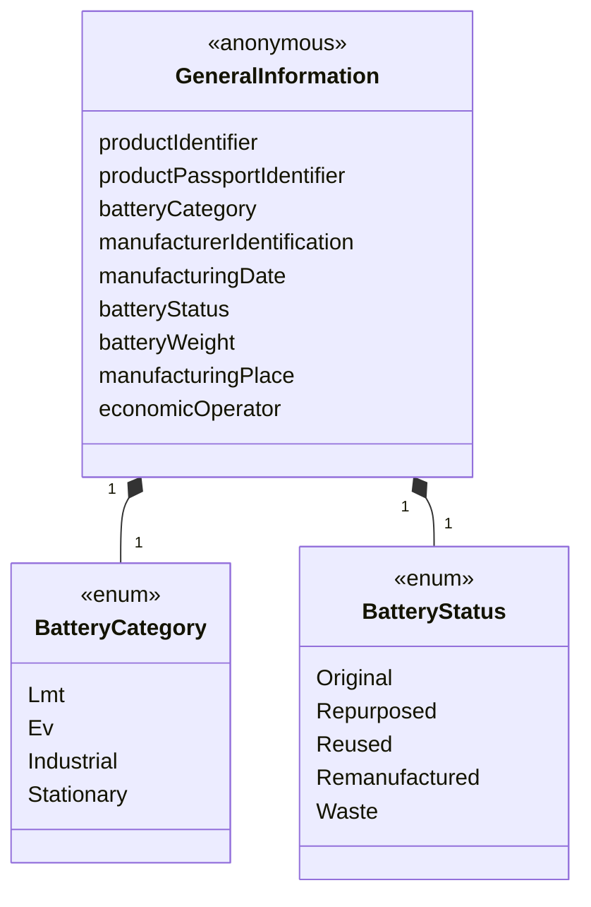
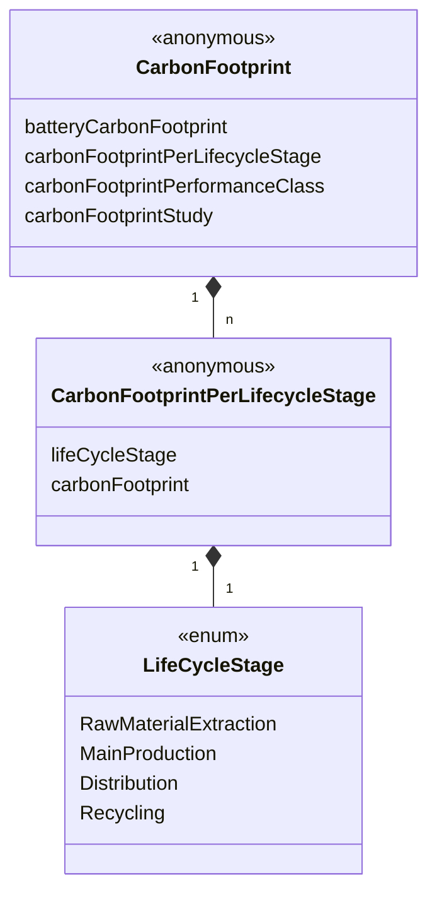
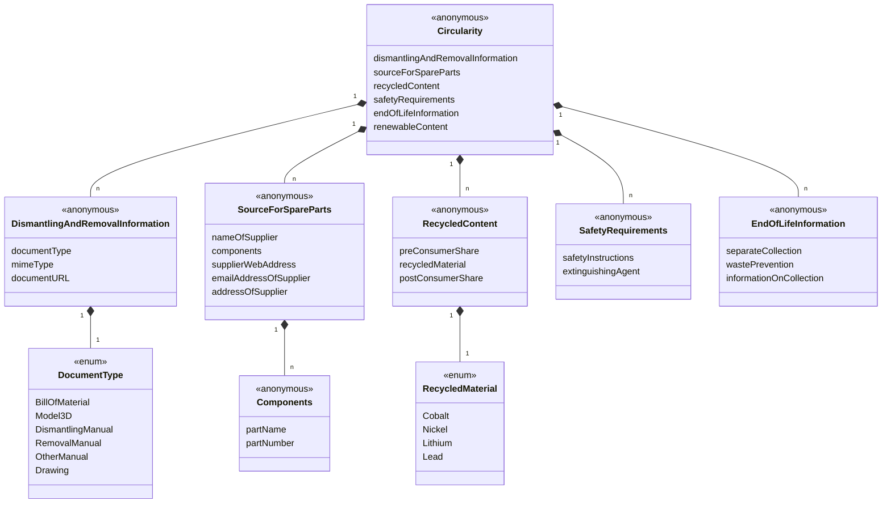
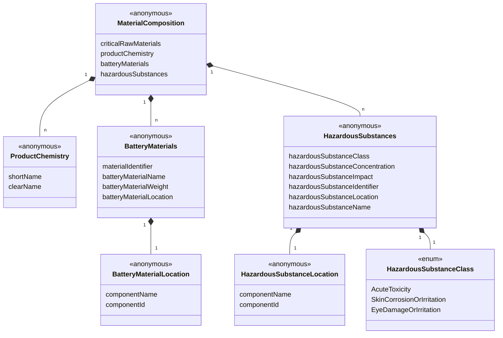
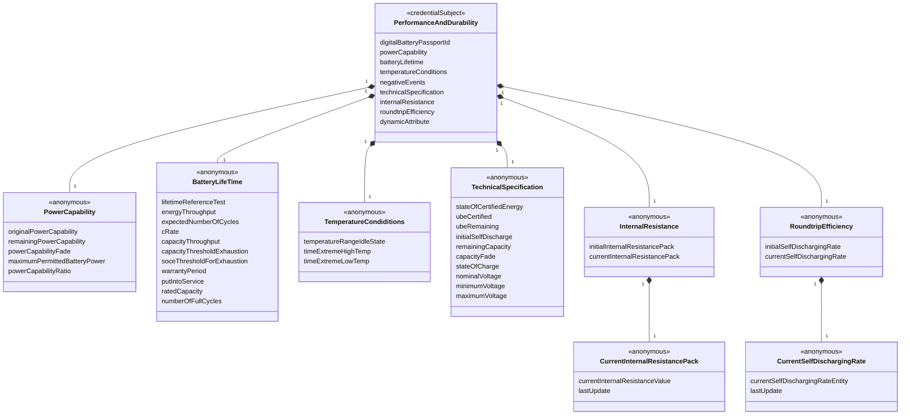
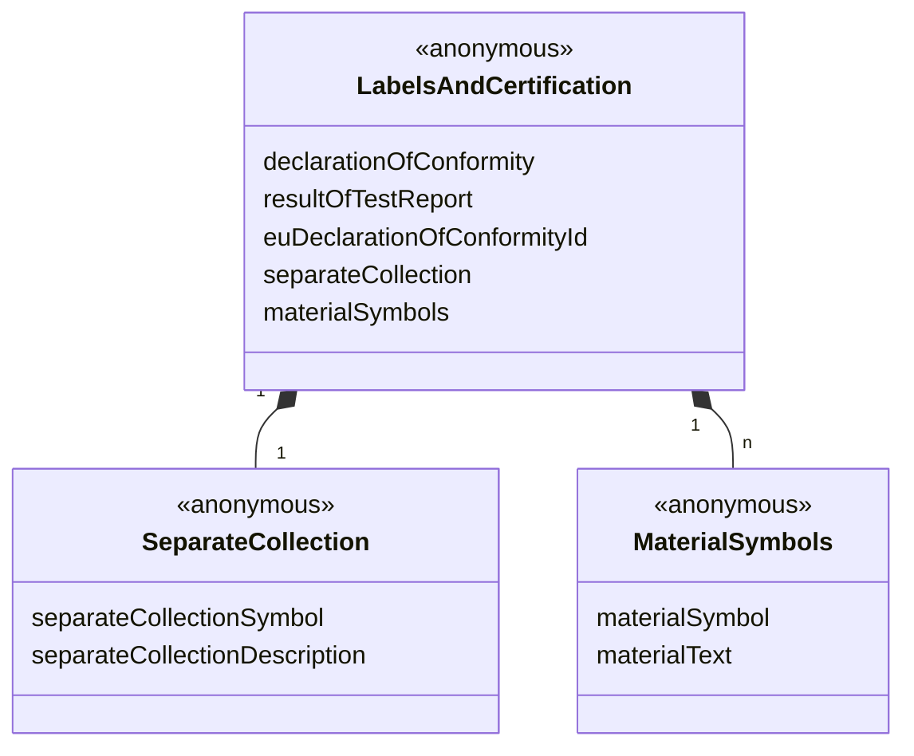

## 1 Abstract

This specification describes an experimental vocabulary for asserting a DBP.

Click here to open the JSON-LD file: [dbp.jsonld](https://dpp-vocabulary.spherity.com/contexts/dbp/v1.jsonld)

## 2 Use Case and Requirements

## 3 Examples

```json
{
  "@context": "https://dpp-vocabulary.spherity.com/contexts/dbp/v1.jsonld",
  "id": "did:web:impactnewenergy.com:dbp:640-265-c-00-640-2405-00024-826-b-01-c-2001-a-0-ea-8",
  "type": "DigitalBatteryPassport",
  "generalInformation": {
    "productIdentifier": "did:web:impactnewenergy.com:dbp:640-265-c-00-640-2405-00024-826-b-01-c-2001-a-0-ea-8",
    "batteryCategory": "Ev",
    "manufacturerIdentification": "did:web:impactnewenergy.com",
    "manufacturingDate": "2024-01-01T00:00:00Z",
    "batteryStatus": "Original",
    "batteryWeight": 550,
    "manufacturingPlace": {
      "addressCountry": "PL",
      "addressStreet": "Przejazdowa 22",
      "postalCode": "05-800",
      "addressLocality": "Pruszków"
    },
    "economicOperator": "did:web:solarisbus.com"
  },
  "carbonFootprint": {
    "batteryCarbonFootprint": 0.20315,
    "carbonFootprintPerLifecycleStage": [
      {
        "lifeCycleStage": "RawMaterialExtraction",
        "carbonFootprint": 7.18
      },
      {
        "lifeCycleStage": "MainProduction",
        "carbonFootprint": 0.22
      },
      {
        "lifeCycleStage": "Distribution",
        "carbonFootprint": 0.42
      },
      {
        "lifeCycleStage": "Recycling",
        "carbonFootprint": 92.19
      }
    ],
    "carbonFootprintStudy": "https://ghgprotocol.org/sites/default/files/standards/Product-Life-Cycle-Accounting-Reporting-Standard_041613.pdf"
  },
  "circularity": {
    "sourceForSpareParts": {
      "nameOfSupplier": "Impact Clean Power Technology S.A.",
      "emailAddressOfSupplier": "email:info@icpt.pl",
      "supplierWebAddress": "https://impactnewenergy.com",
      "addressOfSupplier": {
        "addressCountry": "PL",
        "addressStreet": "Przejazdowa 22",
        "postalCode": "05-800",
        "addressLocality": "Pruszków"
      }
    },
    "recycledContent": [
      {
        "preConsumerShare": 95,
        "recycledMaterial": "Cobalt",
        "postConsumerShare": 95
      },
      {
        "preConsumerShare": 95,
        "recycledMaterial": "Nickel",
        "postConsumerShare": 95
      },
      {
        "preConsumerShare": 95,
        "recycledMaterial": "Lithium",
        "postConsumerShare": 95
      }
    ],
    "safetyRequirements": {
      "safetyInstructions": "https://files-vera.spherity.com/solaris/Safety%20measures.pdf",
      "extinguishingAgent": "Class C"
    }
  },
  "materialComposition": {
    "criticalRawMaterials": [
      "Lithium",
      "Antimony",
      "Phosphorus",
      "Bauxite/Alumina/Aluminium",
      "Silicon metal",
      "Bismuth",
      "Cobalt",
      "Magnesium",
      "Titanium metal",
      "Manganese",
      "Copper",
      "Graphite",
      "Nickel"
    ],
    "batteryChemistry": {
      "shortName": "NMC/Gr",
      "longName": "Lithium-Nickel-Manganese-Cobalt-Oxide (LiNiMnCoO2)/Graphite"
    },
    "batteryMaterial": [
      {
        "batteryMaterialLocation": {
          "componentName": "Cathode"
        },
        "batteryMaterialWeight": 6.125,
        "batteryMaterialName": "Aluminum (metal)",
        "materialIdentifier": "7429-90-5"
      },
      {
        "batteryMaterialLocation": {
          "componentName": "Cathode"
        },
        "batteryMaterialWeight": 7.125,
        "batteryMaterialName": "Lithium",
        "materialIdentifier": "7439-93-2"
      },
      {
        "batteryMaterialLocation": {
          "componentName": "Cathode"
        },
        "batteryMaterialWeight": 44.875,
        "batteryMaterialName": "Nickel oxide",
        "materialIdentifier": "11099-02-8"
      },
      {
        "batteryMaterialLocation": {
          "componentName": "Cathode"
        },
        "batteryMaterialWeight": 19.375,
        "batteryMaterialName": "Cobalt oxide",
        "materialIdentifier": "1307-96-6"
      },
      {
        "batteryMaterialLocation": "Cathode",
        "batteryMaterialWeight": 19.375,
        "batteryMaterialName": "Manganese oxide",
        "materialIdentifier": "1344-43-0"
      },
      {
        "batteryMaterialLocation": {
          "componentName": "Cathode"
        },
        "batteryMaterialWeight": 3.125,
        "batteryMaterialName": "Confidential",
        "materialIdentifier": "System"
      },
      {
        "batteryMaterialLocation": {
          "componentName": "Anode"
        },
        "batteryMaterialWeight": 19.6,
        "batteryMaterialName": "Copper",
        "materialIdentifier": "7440-50-8"
      },
      {
        "batteryMaterialLocation": {
          "componentName": "Anode"
        },
        "batteryMaterialWeight": 77.6,
        "batteryMaterialName": "Carbon",
        "materialIdentifier": "7440-44-0"
      },
      {
        "batteryMaterialLocation": {
          "componentName": "Anode"
        },
        "batteryMaterialWeight": 2.8,
        "batteryMaterialName": "Confidential",
        "materialIdentifier": "System"
      },
      {
        "batteryMaterialLocation": {
          "componentName": "Electrolyte"
        },
        "batteryMaterialWeight": 12.5,
        "batteryMaterialName": "Lithium hexafluorophosphate",
        "materialIdentifier": "21324-40-3"
      },
      {
        "batteryMaterialLocation": {
          "componentName": "Electrolyte"
        },
        "batteryMaterialWeight": 51,
        "batteryMaterialName": "Ethyl Methyl Carbonate",
        "materialIdentifier": "623-53-0"
      },
      {
        "batteryMaterialLocation": {
          "componentName": "Electrolyte"
        },
        "batteryMaterialWeight": 28,
        "batteryMaterialName": "Ethylene carbonate",
        "materialIdentifier": "96-49-1"
      },
      {
        "batteryMaterialLocation": {
          "componentName": "Electrolyte"
        },
        "batteryMaterialWeight": 8.5,
        "batteryMaterialName": "Confidential",
        "materialIdentifier": "System"
      }
    ]
  },
  "labelsAndCertification": {
    "resultsOfTestReports": "https://files-vera.spherity.com/solaris/Test%20report.pdf",
    "separateCollectionSymbol": "https://europa.eu/youreurope/business/images/icons/WEEE_symbol.png",
    "euDeclarationOfConformity": "https://files-vera.spherity.com/solaris/EU%20declaration.pdf",
    "meaningOfLabelsAndSymbols": "https://files-vera.spherity.com/solaris/Label%20explanation.pdf"
  },
  "dueDilligence": {
    "supplyChainDueDilligenceReport": "https://www.solarisbus.com/public/assets/content/firma/esg/2023/Raport_Zrownowazonego_Rozwoju_2023_ENG.pdf",
    "sustainabilityReport": "https://www.solarisbus.com/public/assets/content/firma/esg/2023/Raport_Zrownowazonego_Rozwoju_2023_ENG.pdf"
  }
}

```
## 4 Information Model

### Credential Subjects


### GeneralInformation



### CarbonFootprint



### Circularity



### MaterialComposition



### PerformanceAndDurability



### LabelsAndCertification



### DueDilligence


## 5 Classes

### 5.1 DigitalBatteryPassportCertificate {#DigitalBatteryPassportCertificate}

### 5.2 DigitalBatteryPassport {#DigitalBatteryPassport}

### 5.3 PerformanceAndDurability {#PerformanceAndDurability}

## 6 Properties

### 6.1 Properties of DigitalBatteryPassport

#### 6.1.1 generalInformation {#DigitalBatteryPassport_generalInformation}

##### 6.1.1.1 productIdentifier {#DigitalBatteryPassport_generalInformation_productIdentifier}
Unique identifier allowing for the unambiguous identification of each individual battery and hence each corresponding battery passport (exploration of a potential additional battery passport identifier (not required per Battery Regulation) ongoing).
.

| Key            | Value                                                                                               |
|----------------|-----------------------------------------------------------------------------------------------------|
| Term           | productIdentifier                                                                                   |
| URL            | https://dpp-vocabulary.spherity.com/dbp#DigitalBatteryPassport_generalInformation_productIdentifier |
| Expected Value | IRI                                                                                                 |

##### 6.1.1.2 productPassportIdentifier {#DigitalBatteryPassport_generalInformation_productPassportIdentifier}

##### 6.1.1.3 batteryCategory {#DigitalBatteryPassport_generalInformation_batteryCategory}

##### 6.1.1.3.1 batteryCategory {#DigitalBatteryPassport_generalInformation_batteryCategory}

##### 6.1.1.4 manufacturerIdentification {#DigitalBatteryPassport_generalInformation_manufacturerIdentification}

##### 6.1.1.5 manufacturingDate {#DigitalBatteryPassport_generalInformation_manufacturingDate}

##### 6.1.1.6 batteryStatus {#DigitalBatteryPassport_generalInformation_batteryStatus}

##### 6.1.1.7 batteryWeight {#DigitalBatteryPassport_generalInformation_batteryWeight}

##### 6.1.1.8 manufacturingPlace {#DigitalBatteryPassport_generalInformation_manufacturingPlace}

##### 6.1.1.9 economicOperator {#DigitalBatteryPassport_generalInformation_economicOperator}

#### 6.1.2 carbonFootprint {#DigitalBatteryPassport_carbonFootprint}

##### 6.1.2.1 batteryCarbonFootprint {#DigitalBatteryPassport_carbonFootprint_batteryCarbonFootprint}

##### 6.1.2.2 carbonFootprintPerLifecycleStage {#DigitalBatteryPassport_carbonFootprint_carbonFootprintPerLifecycleStage}

###### 6.1.2.2.1 lifeCycleStage {#DigitalBatteryPassport_carbonFootprint_carbonFootprintPerLifecycleStage_lifeCycleStage}

###### 6.1.2.2.2 carbonFootprint {#DigitalBatteryPassport_carbonFootprint_carbonFootprintPerLifecycleStage_carbonFootprint}

##### 6.1.2.3 carbonFootprintPerformanceClass {#DigitalBatteryPassport_carbonFootprint_carbonFootprintPerformanceClass}

##### 6.1.2.4 carbonFootprintStudy {#DigitalBatteryPassport_carbonFootprint_carbonFootprintStudy}

#### 6.1.3 circularity {#DigitalBatteryPassport_circularity}

#### 6.1.3.1 dismantlingAndRemovalInformation {#DigitalBatteryPassport_circularity_dismantlingAndRemovalInformation}

##### 6.1.3.1.1 documentType {#DigitalBatteryPassport_circularity_dismantlingAndRemovalInformation_documentType}

##### 6.1.3.1.2 mimeType {#DigitalBatteryPassport_circularity_dismantlingAndRemovalInformation_mimeType}

##### 6.1.3.1.3 documentURL {#DigitalBatteryPassport_circularity_dismantlingAndRemovalInformation_documentURL}

#### 6.1.3.2 sourceForSpareParts {#DigitalBatteryPassport_circularity_sourceForSpareParts}

##### 6.1.3.2.1 nameOfSupplier {#DigitalBatteryPassport_circularity_sourceForSpareParts_nameOfSupplier}

##### 6.1.3.2.2 components {#DigitalBatteryPassport_circularity_sourceForSpareParts_components}

##### 6.1.3.2.1 components {#DigitalBatteryPassport_circularity_sourceForSpareParts_components_partName}

##### 6.1.3.2.2 components {#DigitalBatteryPassport_circularity_sourceForSpareParts_components_partNumber}

##### 6.1.3.2.3 supplierWebAddress {#DigitalBatteryPassport_circularity_sourceForSpareParts_supplierWebAddress}

##### 6.1.3.2.4 emailAddressOfSupplier {#DigitalBatteryPassport_circularity_sourceForSpareParts_emailAddressOfSupplier}

##### 6.1.3.2.5 addressOfSupplier {#DigitalBatteryPassport_circularity_sourceForSpareParts_addressOfSupplier}

#### 6.1.3.3 recycledContent {#DigitalBatteryPassport_circularity_recycledContent}

##### 6.1.3.3.1 preConsumerShare {#DigitalBatteryPassport_circularity_recycledContent_preConsumerShare}

##### 6.1.3.3.2 recycledMaterial {#DigitalBatteryPassport_circularity_recycledContent_recycledMaterial}

##### 6.1.3.3.3 postConsumerShare {#DigitalBatteryPassport_circularity_recycledContent_postConsumerShare}

#### 6.1.3.4 safetyRequirements {#DigitalBatteryPassport_circularity_safetyRequirements}

##### 6.1.3.4.1 safetyInstructions {#DigitalBatteryPassport_circularity_safetyRequirements_safetyInstructions}

##### 6.1.3.4.2 extinguishingAgent {#DigitalBatteryPassport_circularity_safetyRequirements_extinguishingAgent}

#### 6.1.3.5 endOfLifeInformation {#DigitalBatteryPassport_circularity_endOfLifeInformation}

#### 6.1.3.5 separateCollection {#DigitalBatteryPassport_circularity_endOfLifeInformation_separateCollection}

#### 6.1.3.5 wastePrevention {#DigitalBatteryPassport_circularity_endOfLifeInformation_wastePrevention}

#### 6.1.3.5 informationOnCollection {#DigitalBatteryPassport_circularity_endOfLifeInformation_informationOnCollection}

#### 6.1.3.6 renewableContent {#DigitalBatteryPassport_circularity_renewableContent}

#### 6.1.4 materialComposition {#DigitalBatteryPassport_materialComposition}

##### 6.1.4.1 criticalRawMaterials {#DigitalBatteryPassport_materialComposition_criticalRawMaterials}

##### 6.1.4.2 productChemistry {#DigitalBatteryPassport_materialComposition_productChemistry}

###### 6.1.4.2.1 shortName {#DigitalBatteryPassport_materialComposition_productChemistry_shortName}

###### 6.1.4.2.2 clearName {#DigitalBatteryPassport_materialComposition_productChemistry_clearName}

##### 6.1.4.3 batteryMaterials {#DigitalBatteryPassport_materialComposition_batteryMaterials}

###### 6.1.4.3.1 materialIdentifier {#DigitalBatteryPassport_materialComposition_batteryMaterials_materialIdentifier}

###### 6.1.4.3.2 batteryMaterialName {#DigitalBatteryPassport_materialComposition_batteryMaterials_batteryMaterialName}

###### 6.1.4.3.3 batteryMaterialWeight {#DigitalBatteryPassport_materialComposition_batteryMaterials_batteryMaterialWeight}

###### 6.1.4.3.4 batteryMaterialLocation {#DigitalBatteryPassport_materialComposition_batteryMaterials_batteryMaterialLocation}

###### 6.1.4.3.4.1 componentName {#DigitalBatteryPassport_materialComposition_batteryMaterials_batteryMaterialLocation_componentName}

###### 6.1.4.3.4.2 componentId {#DigitalBatteryPassport_materialComposition_batteryMaterials_batteryMaterialLocation_componentId}

##### 6.1.4.4 hazardousSubstances {#DigitalBatteryPassport_materialComposition_hazardousSubstances}

###### 6.1.4.4.1 hazardousSubstanceClass {#DigitalBatteryPassport_materialComposition_hazardousSubstances_hazardousSubstanceClass}

###### 6.1.4.4.2 hazardousSubstanceConcentration {#DigitalBatteryPassport_materialComposition_hazardousSubstances_hazardousSubstanceConcentration}

###### 6.1.4.4.3 hazardousSubstanceImpact {#DigitalBatteryPassport_materialComposition_hazardousSubstances_hazardousSubstanceImpact}

###### 6.1.4.4.4 hazardousSubstanceIdentifier {#DigitalBatteryPassport_materialComposition_hazardousSubstances_hazardousSubstanceIdentifier}

###### 6.1.4.4.5 hazardousSubstanceLocation {#DigitalBatteryPassport_materialComposition_hazardousSubstances_hazardousSubstanceLocation}

###### 6.1.4.4.5.1 componentName {#DigitalBatteryPassport_materialComposition_hazardousSubstances_hazardousSubstanceLocation_componentName}

###### 6.1.4.4.5.2 componentId {#DigitalBatteryPassport_materialComposition_hazardousSubstances_hazardousSubstanceLocation_componentId}

###### 6.1.4.4.6 hazardousSubstanceName {#DigitalBatteryPassport_materialComposition_hazardousSubstances_hazardousSubstanceName}

#### 6.1.5 labelsAndCertification {#DigitalBatteryPassport_labelsAndCertification}

##### 6.1.5.1 declarationOfConformity {#DigitalBatteryPassport_labelsAndCertification_declarationOfConformity}

##### 6.1.5.2 resultOfTestReport {#DigitalBatteryPassport_labelsAndCertification_resultOfTestReport}

##### 6.1.5.3 euDeclarationOfConformityId {#DigitalBatteryPassport_labelsAndCertification_euDeclarationOfConformityId}

##### 6.1.5.4 separateCollection {#DigitalBatteryPassport_labelsAndCertification_separateCollection}

###### 6.1.5.4.1 separateCollectionSymbol {#DigitalBatteryPassport_labelsAndCertification_separateCollection_separateCollectionSymbol}

###### 6.1.5.4.2 separateCollectionDescription {#DigitalBatteryPassport_labelsAndCertification_separateCollection_separateCollectionDescription}

##### 6.1.5.5 materialSymbols {#DigitalBatteryPassport_labelsAndCertification_materialSymbols}

###### 6.1.5.5.1 materialSymbol {#DigitalBatteryPassport_labelsAndCertification_materialSymbols_materialSymbol}

###### 6.1.5.5.2 materialText {#DigitalBatteryPassport_labelsAndCertification_materialSymbols_materialText}

#### 6.1.6 dueDilligence {#DigitalBatteryPassport_dueDilligence}

##### 6.1.6.1 supplyChainDueDillgenceReport {#DigitalBatteryPassport_dueDilligence_supplyChainDueDilligenceReport}

##### 6.1.6.2 thirdPartyAussurances {#DigitalBatteryPassport_dueDilligence_thirdPartyAussurances}

##### 6.1.6.3 euTaxonomyDisclosureStatement {#DigitalBatteryPassport_dueDilligence_euTaxonomyDisclosureStatement}

##### 6.1.6.4 sustainabilityReport {#DigitalBatteryPassport_dueDilligence_sustainabilityReport}

## 7. Code Lists

### 7.1 BatteryCategory

#### 7.1.1 Lmt {#DigitalBatteryPassport_generalInformation_batteryCategory_Lmt}

#### 7.1.2 Ev {#DigitalBatteryPassport_generalInformation_batteryCategory_Ev}

#### 7.1.3 Industrial {#DigitalBatteryPassport_generalInformation_batteryCategory_Industrial}

#### 7.1.4 Stationary {#DigitalBatteryPassport_generalInformation_batteryCategory_Stationary}

### 7.2 BatteryStatus

#### 7.2.1 Original {#DigitalBatteryPassport_generalInformation_batteryStatus_Original}

#### 7.2.2 Repurposed {#DigitalBatteryPassport_generalInformation_batteryStatus_Repurposed}

#### 7.2.3 Reused {#DigitalBatteryPassport_generalInformation_batteryStatus_Reused}

#### 7.2.4 Remanufactured {#DigitalBatteryPassport_generalInformation_batteryStatus_Remanufactured}

#### 7.2.5 Waste {#DigitalBatteryPassport_generalInformation_batteryStatus_Waste}

### 7.3 LifeCycleStage

#### 7.3.1 RawMaterialExtraction {#DigitalBatteryPassport_carbonFootprint_carbonFootprintPerLifecycleStage_lifeCycleStage_RawMaterialExtraction}

#### 7.3.2 MainProduction {#DigitalBatteryPassport_carbonFootprint_carbonFootprintPerLifecycleStage_lifeCycleStage_MainProduction}

#### 7.3.3 Distribution {#DigitalBatteryPassport_carbonFootprint_carbonFootprintPerLifecycleStage_lifeCycleStage_Distribution}

#### 7.3.4 Recycling {#DigitalBatteryPassport_carbonFootprint_carbonFootprintPerLifecycleStage_lifeCycleStage_Recycling}

### 7.4 DocumentType

#### 7.4.1 BillOfMaterial {#DigitalBatteryPassport_circularity_dismantlingAndRemovalInformation_documentType_BillOfMaterial}

#### 7.4.2 Model3D {#DigitalBatteryPassport_circularity_dismantlingAndRemovalInformation_documentType_Model3D}

#### 7.4.3 DismantlingManual {#DigitalBatteryPassport_circularity_dismantlingAndRemovalInformation_documentType_DismantlingManual}

#### 7.4.4 RemovalManual {#DigitalBatteryPassport_circularity_dismantlingAndRemovalInformation_documentType_RemovalManual}

#### 7.4.5 OtherManual {#DigitalBatteryPassport_circularity_dismantlingAndRemovalInformation_documentType_OtherManual}

#### 7.4.6 Drawing {#DigitalBatteryPassport_circularity_dismantlingAndRemovalInformation_documentType_Drawing}

### 7.5 RecycledMaterial

#### 7.5.1 Cobalt {#DigitalBatteryPassport_circularity_recycledContent_recycledMaterial_Cobalt}

#### 7.5.2 Nickel {#DigitalBatteryPassport_circularity_recycledContent_recycledMaterial_Nickel}

#### 7.5.3 Lithium {#DigitalBatteryPassport_circularity_recycledContent_recycledMaterial_Lithium}

#### 7.5.4 Lead {#DigitalBatteryPassport_circularity_recycledContent_recycledMaterial_Lead}

### 7.6 HazardousSubstanceClass

#### 7.6.1 AcuteToxicity {#DigitalBatteryPassport_materialComposition_hazardousSubstances_hazardSubstanceClass_AcuteToxicity}

#### 7.6.2 SkinCorrosionOrIrritation {#DigitalBatteryPassport_materialComposition_hazardousSubstances_hazardSubstanceClass_SkinCorrosionOrIrritation}

#### 7.6.3 EyeDamageOrIrritation {#DigitalBatteryPassport_materialComposition_hazardousSubstances_hazardSubstanceClass_EyeDamageOrIrritation}

## 8 External Types

### 8.1 dateTime {#dateTime}

## References

* [Verifiable Credentials Data Model v2.0](https://www.w3.org/TR/vc-data-model-2.0). Manu Sporny, Ted Thibodeau Jr, Ivan Herman, Michael B. Jones, Gabe Cohen. 2024
