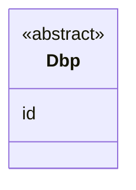

## 1 Abstract

This specification describes an experimental vocabulary for asserting a DBP.

Click here to open the JSON-LD file: [dbp.jsonld](https://dpp.spherity.com/contexts/dbp/v1.jsonld)

## 2 Use Case and Requirements

## 3 Examples

## 4 Information Model

## 5 Classes

Enim deserunt occaecat adipisicing non non id.

### 5.1 Class 1

### 5.2 Class 1.1 {#LegalPerson}

Aute dolor reprehenderit culpa ipsum ipsum.

## 6 Properties

## References

* [Verifiable Credentials Data Model v2.0](https://www.w3.org/TR/vc-data-model-2.0). Manu Sporny, Ted Thibodeau Jr, Ivan Herman, Michael B. Jones, Gabe Cohen. 2024
