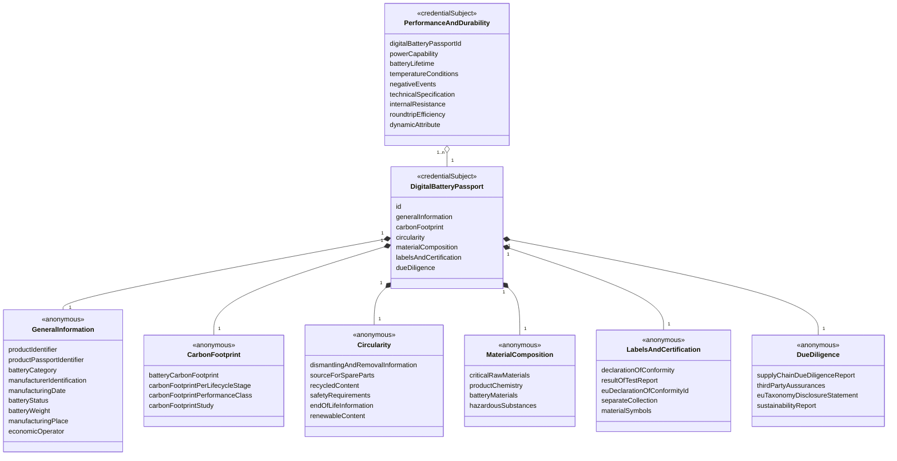
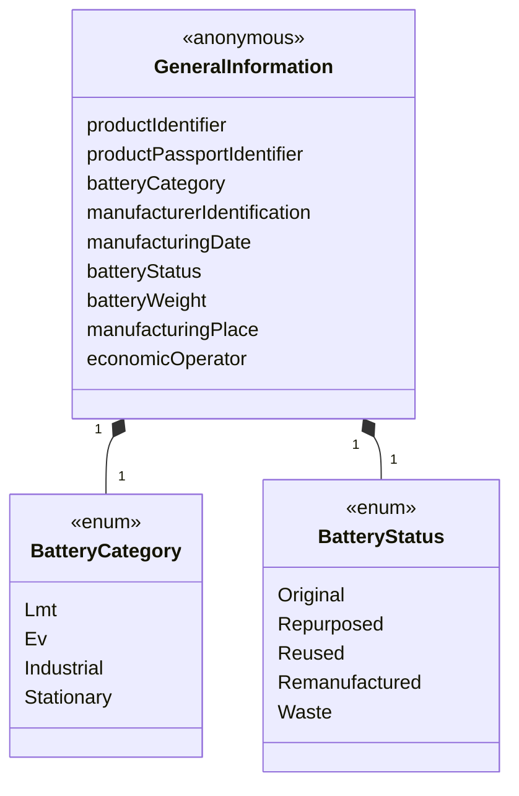
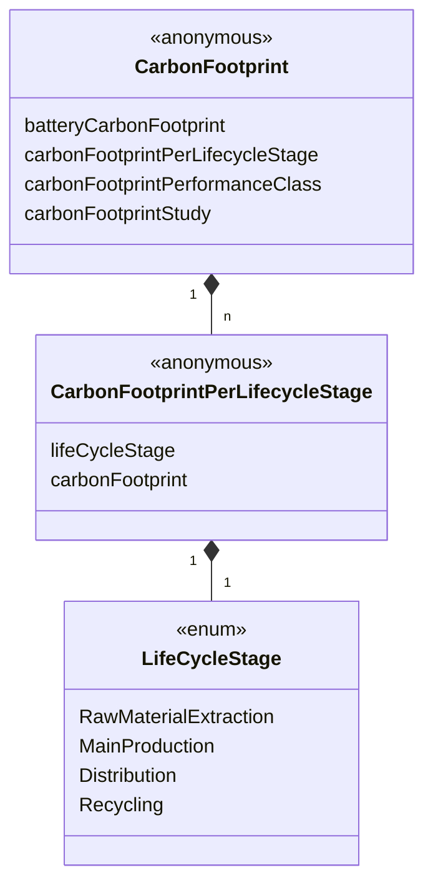
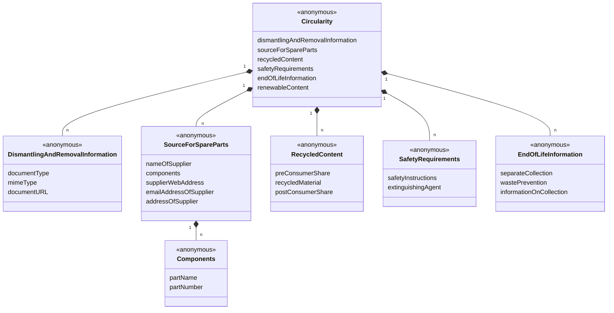
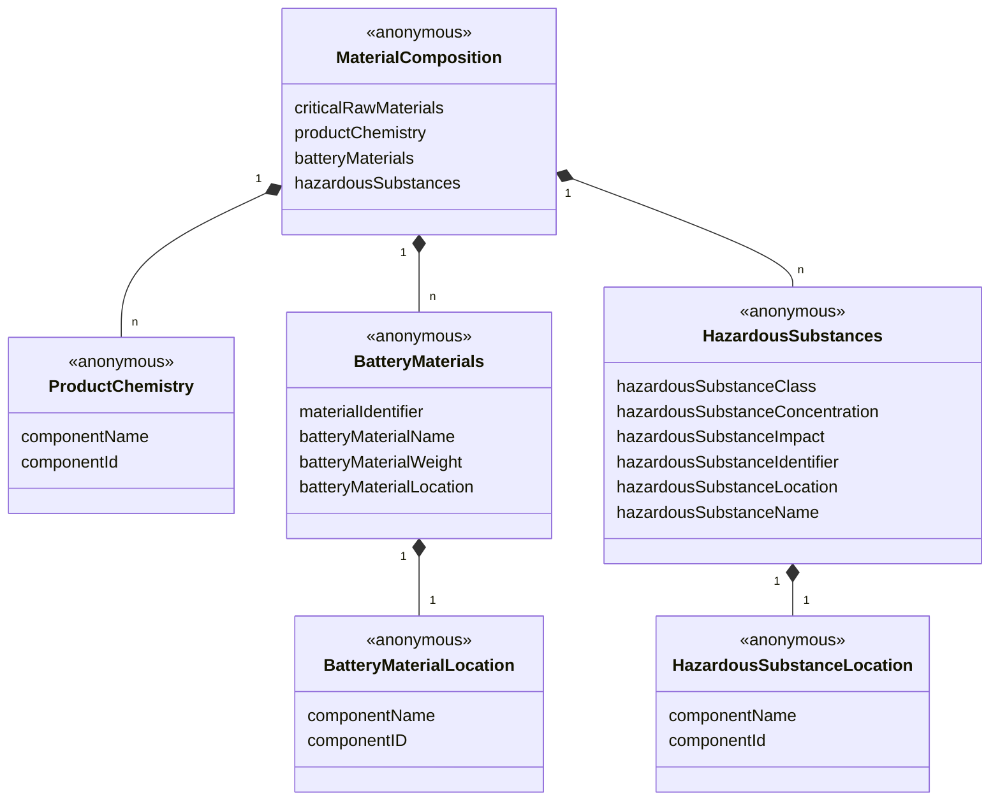
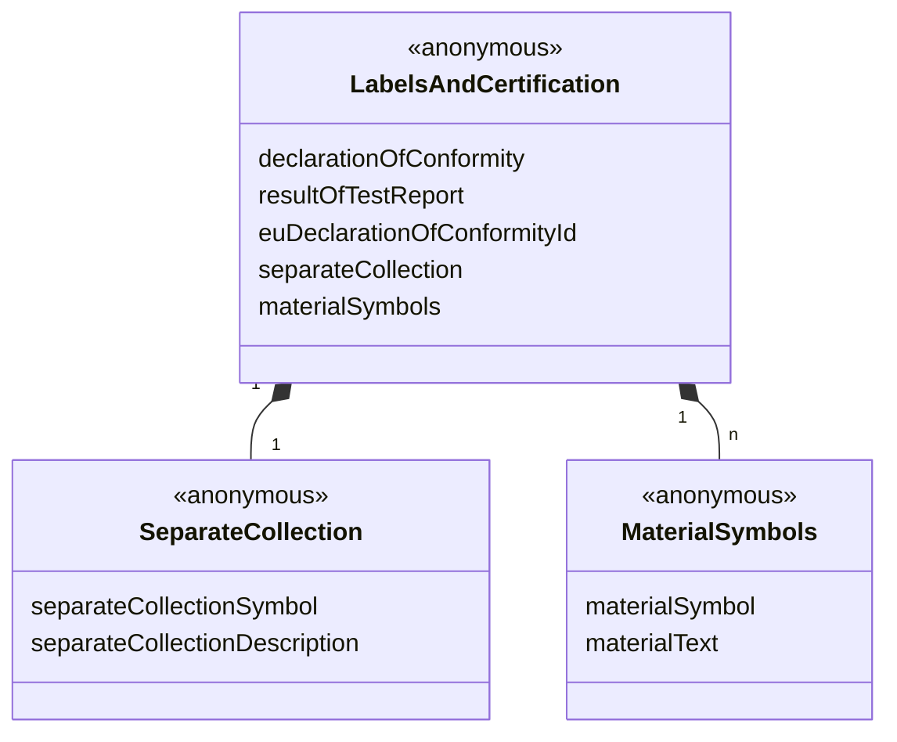
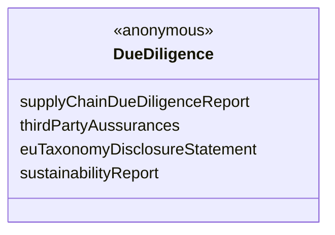

## 1 Abstract

This specification describes an experimental vocabulary for asserting a DBP.

Click here to open the JSON-LD file: [dbp.jsonld](https://dpp-vocabulary.spherity.com/contexts/dbp/v1.jsonld)

## 2 Use Case and Requirements

## 3 Examples

```json
{
  "@context": "https://dpp-vocabulary.spherity.com/contexts/dbp/v1.jsonld",
  "id": "did:web:impactnewenergy.com:dbp:640-265-c-00-640-2405-00024-826-b-01-c-2001-a-0-ea-8",
  "type": "DigitalBatteryPassport",
  "generalInformation": {
    "productIdentifier": "did:web:impactnewenergy.com:dbp:640-265-c-00-640-2405-00024-826-b-01-c-2001-a-0-ea-8",
    "batteryCategory": "Ev",
    "manufacturerIdentification": "did:web:impactnewenergy.com",
    "manufacturingDate" : "2024-01-01T00:00:00Z",
    "batteryStatus" : "Original",
    "batteryWeight": 550,
    "manufacturingPlace" : {
      "addressCountry" : "PL",
      "addressStreet" : "Przejazdowa 22",
      "postalCode" : "05-800",
      "addressLocality" : "Pruszków"
    },
    "economicOperator" : "did:web:solarisbus.com"
  },
  "carbonFootprint": {
    "batteryCarbonFootprint" : 0.20315,
    "carbonFootprintPerLifecycleStage" : [
      {
        "lifeCycleStage" : "RawMaterialExtraction",
        "carbonFootprint" : 7.18
      },
      {
        "lifeCycleStage" : "MainProduction",
        "carbonFootprint" : 0.22
      },
      {
        "lifeCycleStage" : "Distribution",
        "carbonFootprint" : 0.42
      },
      {
        "lifeCycleStage" : "Recycling",
        "carbonFootprint" : 92.19
      }
    ],
    "carbonFootprintStudy": "https://ghgprotocol.org/sites/default/files/standards/Product-Life-Cycle-Accounting-Reporting-Standard_041613.pdf"
  }
}
```
## 4 Information Model

### Credential Subjects



### GeneralInformation



### CarbonFootprint



### Circularity



### MaterialComposition



### PerformanceAndDurability


### LabelsAndCertification



### DueDiligence



## 5 Classes

### 5.1 DigitalBatteryPassportCertificate {#DigitalBatteryPassportCertificate}

### 5.2 DigitalBatteryPassport {#DigitalBatteryPassport}

### 5.3 PerformanceAndDurability {#PerformanceAndDurability}

### 5.4 External Types

#### 5.4.1 dateTime {#dateTime}

## 6 Properties

### 6.1 Properties of DigitalBatteryPassport

#### 6.1.1 generalInformation {#DigitalBatteryPassport_generalInformation}

##### 6.1.1.1 productIdentifier {#DigitalBatteryPassport_generalInformation_productIdentifier}

##### 6.1.1.2 productPassportIdentifier {#DigitalBatteryPassport_generalInformation_productPassportIdentifier}

##### 6.1.1.3 batteryCategory {#DigitalBatteryPassport_generalInformation_batteryCategory}

##### 6.1.1.3.1 batteryCategory {#DigitalBatteryPassport_generalInformation_batteryCategory}

##### 6.1.1.4 manufacturerIdentification {#DigitalBatteryPassport_generalInformation_manufacturerIdentification}

##### 6.1.1.5 manufacturingDate {#DigitalBatteryPassport_generalInformation_manufacturingDate}

##### 6.1.1.6 batteryStatus {#DigitalBatteryPassport_generalInformation_batteryStatus}

##### 6.1.1.7 batteryWeight {#DigitalBatteryPassport_generalInformation_batteryWeight}

##### 6.1.1.8 manufacturingPlace {#DigitalBatteryPassport_generalInformation_manufacturingPlace}

##### 6.1.1.9 economicOperator {#DigitalBatteryPassport_generalInformation_economicOperator}

#### 6.1.2 carbonFootprint {#DigitalBatteryPassport_carbonFootprint}

##### 6.1.2.1 batteryCarbonFootprint {#DigitalBatteryPassport_carbonFootprint_batteryCarbonFootprint}

##### 6.1.2.2 carbonFootprintPerLifecycleStage {#DigitalBatteryPassport_carbonFootprint_carbonFootprintPerLifecycleStage}

###### 6.1.2.2.1 lifeCycleStage {#DigitalBatteryPassport_carbonFootprint_carbonFootprintPerLifecycleStage_lifeCycleStage}

###### 6.1.2.2.2 carbonFootprint {#DigitalBatteryPassport_carbonFootprint_carbonFootprintPerLifecycleStage_carbonFootprint}

##### 6.1.2.3 carbonFootprintPerformanceClass {#DigitalBatteryPassport_carbonFootprint_carbonFootprintPerformanceClass}

##### 6.1.2.4 carbonFootprintStudy {#DigitalBatteryPassport_carbonFootprint_carbonFootprintStudy}

#### 6.1.3 circularity {#DigitalBatteryPassport_circularity}

#### 6.1.4 materialComposition {#DigitalBatteryPassport_materialComposition}

#### 6.1.5 labelsAndCertification {#DigitalBatteryPassport_labelsAndCertification}

#### 6.1.6 dueDiligence {#DigitalBatteryPassport_dueDiligence}

## 7. Code Lists

### 7.1 BatteryCategory

#### 7.1.1 Lmt {#DigitalBatteryPassport_generalInformation_batteryCategory_Lmt}

#### 7.1.2 Ev {#DigitalBatteryPassport_generalInformation_batteryCategory_Ev}

#### 7.1.3 Industrial {#DigitalBatteryPassport_generalInformation_batteryCategory_Industrial}

#### 7.1.4 Stationary {#DigitalBatteryPassport_generalInformation_batteryCategory_Stationary}

### 7.2 BatteryStatus

#### 7.2.1 Original {#DigitalBatteryPassport_generalInformation_batteryStatus_Original}

#### 7.2.2 Repurposed {#DigitalBatteryPassport_generalInformation_batteryStatus_Repurposed}

#### 7.2.3 Reused {#DigitalBatteryPassport_generalInformation_batteryStatus_Reused}

#### 7.2.4 Remanufactured {#DigitalBatteryPassport_generalInformation_batteryStatus_Remanufactured}

#### 7.2.5 Waste {#DigitalBatteryPassport_generalInformation_batteryStatus_Waste}

### 7.3 LifeCycleStage

#### 7.3.1 RawMaterialExtraction {#DigitalBatteryPassport_carbonFootprint_carbonFootprintPerLifecycleStage_lifeCycleStage_RawMaterialExtraction}

#### 7.3.2 MainProduction {#DigitalBatteryPassport_carbonFootprint_carbonFootprintPerLifecycleStage_lifeCycleStage_MainProduction}

#### 7.3.3 Distribution {#DigitalBatteryPassport_carbonFootprint_carbonFootprintPerLifecycleStage_lifeCycleStage_Distribution}

#### 7.3.4 Recycling {#DigitalBatteryPassport_carbonFootprint_carbonFootprintPerLifecycleStage_lifeCycleStage_Recycling}


## References

* [Verifiable Credentials Data Model v2.0](https://www.w3.org/TR/vc-data-model-2.0). Manu Sporny, Ted Thibodeau Jr, Ivan Herman, Michael B. Jones, Gabe Cohen. 2024
