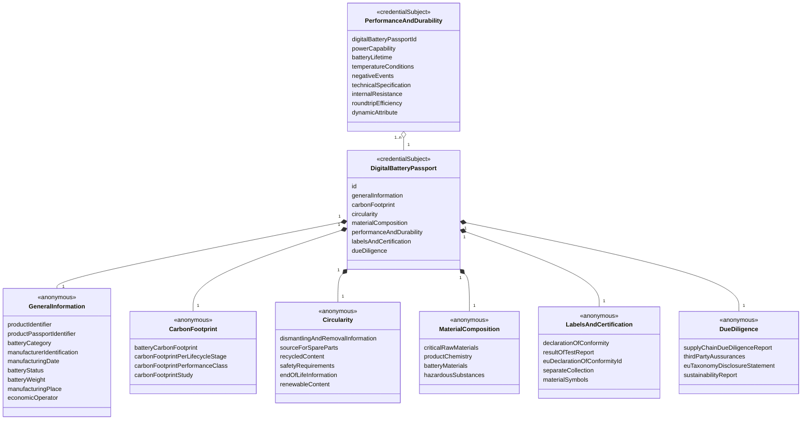
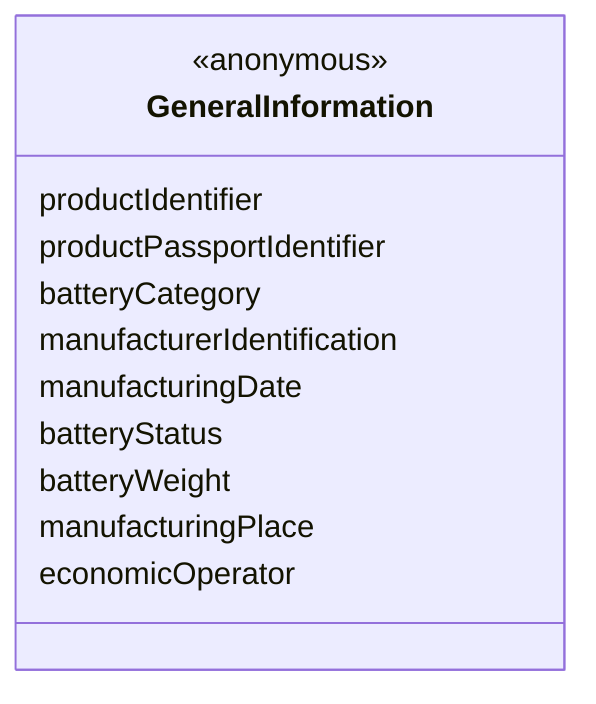
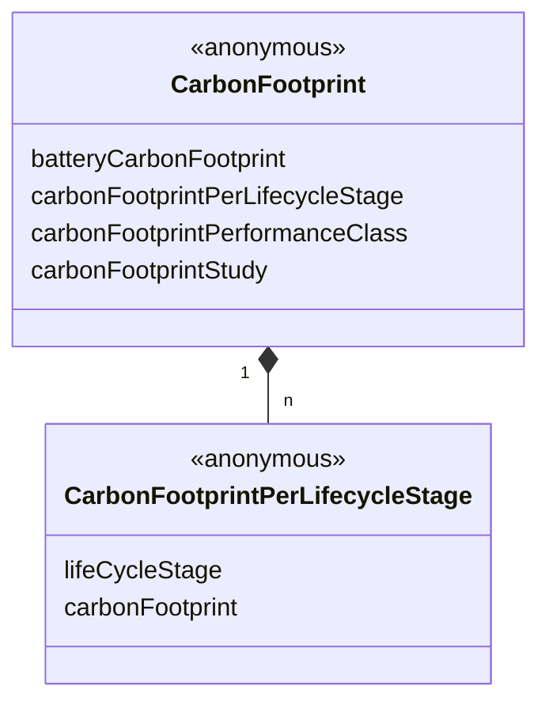
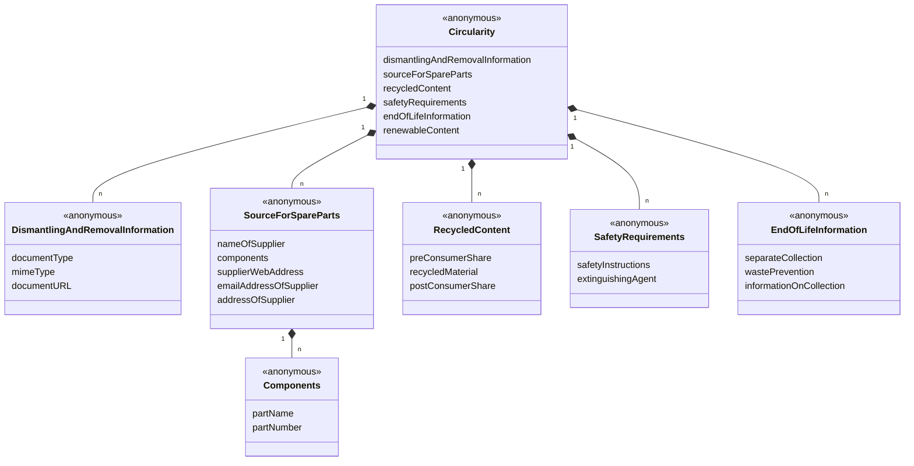
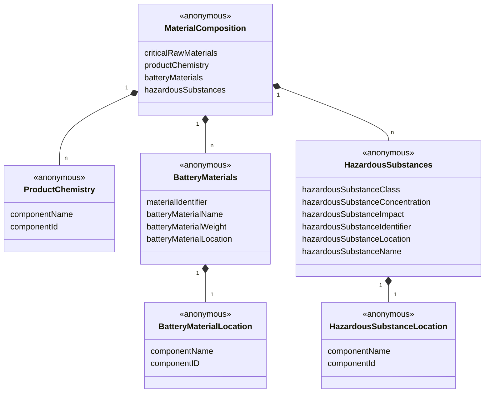
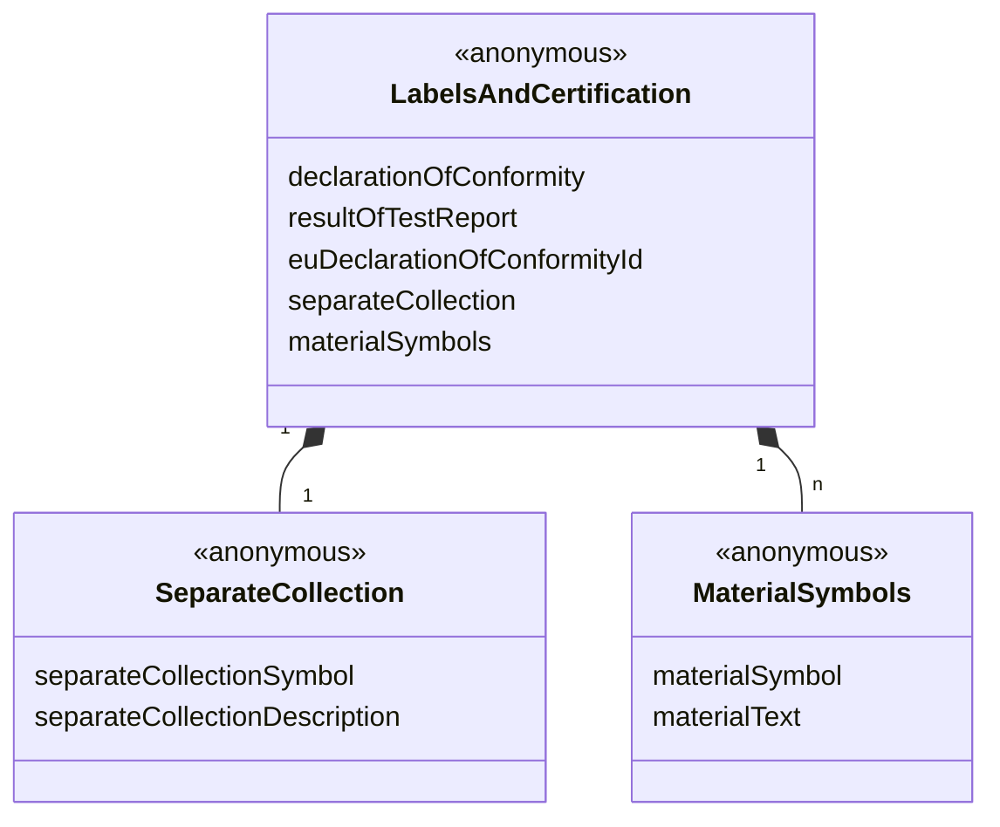
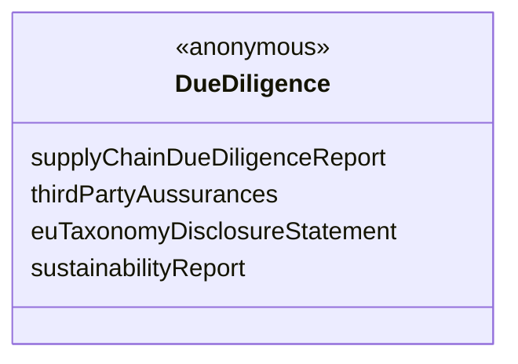

## 1 Abstract

This specification describes an experimental vocabulary for asserting a DBP.

Click here to open the JSON-LD file: [dbp.jsonld](https://dpp.spherity.com/contexts/dbp/v1.jsonld)

## 2 Use Case and Requirements

## 3 Examples

https://github.com/spherity/dpp-vocabulary/blob/main/docs/contexts/dbp/credentials/dbp.jsonld

## 4 Information Model

### Credential Subjects

### GeneralInformation

### CarbonFootprint

### Circularity

### MaterialComposition

### PerformanceAndDurability

### LabelsAndCertification

### DueDiligence

## 5 Classes

### 5.1 DigitalBatteryPassportCertificate {#DigitalBatteryPassportCertificate}

### 5.2 DigitalBatteryPassport {#DigitalBatteryPassport}

### 5.3 PerformanceAndDurability {#PerformanceAndDurability}

## 6 Properties

### 6.1 Properties of DigitalBatteryPassport

#### 6.1.1 generalInformation {#DigitalBatteryPassport_generalInformation}

##### 6.1.1.1 productIdentifier {#DigitalBatteryPassport_generalInformation_productIdentifier}

##### 6.1.1.2 productPassportIdentifier {#DigitalBatteryPassport_generalInformation_productPassportIdentifier}

##### 6.1.1.3 batteryCategory {#DigitalBatteryPassport_generalInformation_batteryCategory}

##### 6.1.1.4 manufacturerIdentification {#DigitalBatteryPassport_generalInformation_manufacturerIdentification}

##### 6.1.1.5 manufacturingDate {#DigitalBatteryPassport_generalInformation_manufacturingDate}

##### 6.1.1.6 batteryStatus {#DigitalBatteryPassport_generalInformation_batteryStatus}

##### 6.1.1.7 batteryWeight {#DigitalBatteryPassport_generalInformation_batteryWeight}

##### 6.1.1.8 manufacturingPlace {#DigitalBatteryPassport_generalInformation_manufacturingPlace}

##### 6.1.1.9 economicOperator {#DigitalBatteryPassport_generalInformation_economicOperator}

#### 6.1.2 carbonFootprint {#DigitalBatteryPassport_carbonFootprint}

##### 6.1.2.1 batteryCarbonFootprint {#DigitalBatteryPassport_carbonFootprint_}

##### 6.1.2.2 carbonFootprintPerLifecycleStage {#DigitalBatteryPassport_carbonFootprint_carbonFootprintPerLifecycleStage}

###### 6.1.2.2.1 lifeCycleStage {#DigitalBatteryPassport_carbonFootprint_carbonFootprintPerLifecycleStage_lifeCycleStage}

###### 6.1.2.2.2 carbonFootprint {#DigitalBatteryPassport_carbonFootprint_carbonFootprintPerLifecycleStage_carbonFootprint}

##### 6.1.2.3 carbonFootprintPerformanceClass {#DigitalBatteryPassport_carbonFootprint_carbonFootprintPerformanceClass}

##### 6.1.2.4 carbonFootprintStudy {#DigitalBatteryPassport_carbonFootprint_carbonFootprintStudy}

#### 6.1.3 circularity {#DigitalBatteryPassport_circularity}

#### 6.1.4 materialComposition {#DigitalBatteryPassport_materialComposition}

#### 6.1.5 labelsAndCertification {#DigitalBatteryPassport_labelsAndCertification}

#### 6.1.6 dueDiligence {#DigitalBatteryPassport_dueDiligence}

## References

* [Verifiable Credentials Data Model v2.0](https://www.w3.org/TR/vc-data-model-2.0). Manu Sporny, Ted Thibodeau Jr, Ivan Herman, Michael B. Jones, Gabe Cohen. 2024
